<div align="center">

# Deckent

**The Agent Control & Execution Plane**

Every action by people, AI agents and tools is authorized, isolated, executed and proven inside your own infrastructure.

*policy-driven agent runtime · governed execution · self-hosted agent control plane*

[](https://github.com/Verhex/deckent-next/actions/workflows/ci.yml)
[](LICENSE)
[](package.json)
[](CHANGELOG.md)

[Türkçe](README.tr.md) · [What it is](#what-is-deckent) · [How a request flows](#how-a-request-flows) · [First session](#your-first-session) · [In the terminal](#in-the-terminal) · [Safety](#safety-model) · [Get started](#get-started)


</div>

<!-- Node and pre-release badges read public main package.json, not this local branch.
Keep package.json version and CHANGELOG.md release line together at each release.
npm badges: enable only after the first npm publish. The unscoped name `deckent` is not usable (conflicts with an existing
package); the planned name is the scoped `@verhex/deckent` (owner 2026-10-07, not final). Verify package identity first.
[](https://www.npmjs.com/package/@verhex/deckent)
[](https://www.npmjs.com/package/@verhex/deckent)
-->

> [!NOTE]
> **Pre-release `1.0.0-alpha.18`**, live since 2026-10-09. Deckent is not on npm yet; install it from source
> as shown in [Get started](#get-started). Every release is listed in [CHANGELOG.md](CHANGELOG.md).

## What is Deckent

AI agents can now write code, run commands and call tools on their own. The hard part is no longer *can the agent
do it*, but *should it, where, on whose authority, and how do we know what happened*. Most products answer only half
of that question: some run agents, others govern agents that run somewhere else.

Deckent is both halves in one product, installed on your own machines. Think of an airport: the **control tower**
decides who may take off and records every flight, and the **runway** is where the flight actually happens. Deckent
is the tower and the runway together. It decides what a person or an agent may do, runs that work in an isolated
place, and keeps a durable record you can check afterwards.

You talk to Deckent through its terminal, its `deckent` command, its MCP server or its SDK. All of them use the same
typed contract, so a human click and an agent's tool call go through exactly the same identity, policy and approval
checks. The open-source Core (Apache-2.0) works on its own; the proprietary Enterprise edition layers on top
without changing Core.

| | |
|---|---|
| 🗼 **Govern** | One identity, scope and policy model for people and AI agents. When something needs approval, the window shows exactly what: the full command, where it runs, on whose behalf, the risk, whether it can be undone, and a deadline. A persona or a model's advice never grants authority. |
| 🛫 **Execute** | Runs, tasks and workers are admitted, scheduled and recovered on your machines. Agent shell commands and MCP servers run in sandboxes (bubblewrap, Landlock); workers run in Docker. Works with Anthropic, OpenAI, DeepSeek, Z.ai (GLM), OpenAI-compatible endpoints, OpenRouter (key only so far) and local vLLM models, and with Claude Code, Codex and Cursor workers. |
| 📜 **Prove** | Every decision and effect lands in a durable ledger and audit trail. Approvals are sealed, patches are retained, and changes are integrated in an isolated candidate before anything is delivered. |

## How a request flows

You ask for something in plain words. Deckent turns it into checked, isolated steps, and nothing runs unless policy
and your permission mode allow it.

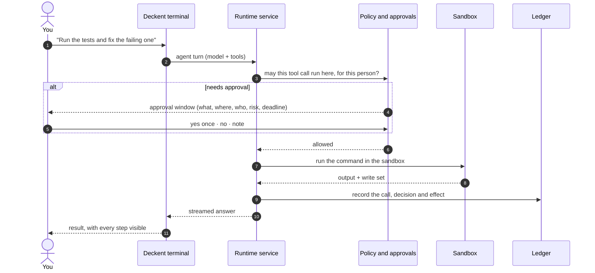

## Your first session

From an empty project to a governed agent turn and what it cost, without leaving Deckent:

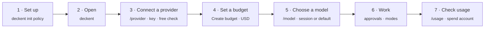

1. **Set up** once per project: `deckent init policy --scope <id> --preview` shows the first-run policy and
   `deckent init policy --scope <id> --apply` installs it. It lets you connect and call models, keep keys and set
   budgets in that scope; every one of those actions is still checked and recorded. On Linux, WSL and macOS a fresh
   installation starts on the encrypted key store.
2. **Open the terminal** with `deckent`.
3. **Connect a provider** with `/provider`: Anthropic API, OpenAI API, DeepSeek API, Z.ai GLM, any OpenAI-compatible
   address or a local server such as vLLM. You type the key into a masked field; Deckent checks it with a free request
   and stores it in the secret store under its name; a key the check rejects is never stored. Where a provider has no
   free check, the key is kept unverified and the first turn shows any rejection. The value is never shown again and
   no agent or worker ever receives it. Then choose **Connect a model** from that provider's catalog. A model
   without a verified published price is listed but locked, with the reason (Zhipu GLM China stays locked because its
   prices are in CNY). OpenRouter stores a key only for now. The same from the command line: `deckent secret set <NAME>`
   and `deckent models connect --scope <id> --connection <kind> --command-id <id> --model <exact id>`.
4. **Set a budget.** Every model turn reserves against one shared USD budget of the scope; without one, every turn is
   refused and the windows say so. The first row of `/provider`, **Create budget**, opens the budget window: 5, 10, 25,
   50 or 100 USD, or another whole-dollar amount from 1 to 1000 with the arrow keys, then a confirm step. Later the
   same row reads **Change budget**. From the command line: `deckent models create-budget --scope <id> --usd <n>` and
   `deckent models revise-budget --scope <id> --usd <n>`.
5. **Choose a model** with `/model`. It lists the catalog's models; one you cannot use yet is locked with the reason
   (no budget, not connected, key missing, not activated) and what fixes it. Pick **This session only** or **This
   session, and make it my default** (your `terminal.defaultModel`). When the project names its own model, the window
   says which setting chose the model in use.
6. **Work.** Ask in plain words. Tool calls follow your company policy and your permission mode; anything that needs
   you opens the approval window (see [Safety model](#safety-model)).
7. **Check usage** with `/usage`: the tokens this conversation measured (reasoning shows *not measured* when the
   provider did not report it) and the scope's budgets; open a budget to read its spend account: limit, reserved and
   settled.

<table>
  <tr>
    <td width="50%">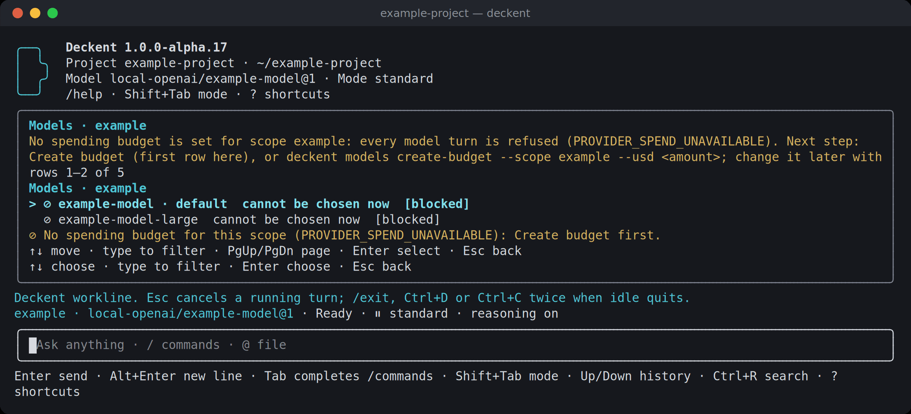<br><sub><b>Before a budget.</b> <code>/model</code> locks every model and names the reason and the next step.</sub></td>
    <td width="50%">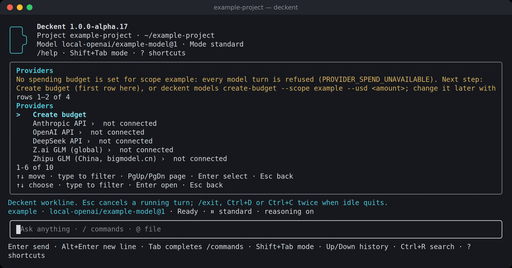<br><sub><b>/provider.</b> <b>Create budget</b> first, then each provider with its connection state.</sub></td>
  </tr>
  <tr>
    <td width="50%">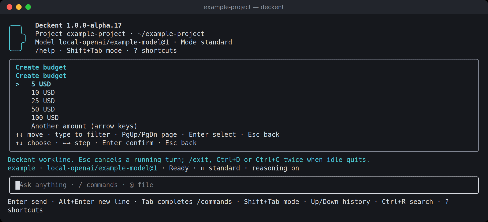<br><sub><b>Budget window.</b> Preset amounts, or another amount with the arrow keys.</sub></td>
    <td width="50%">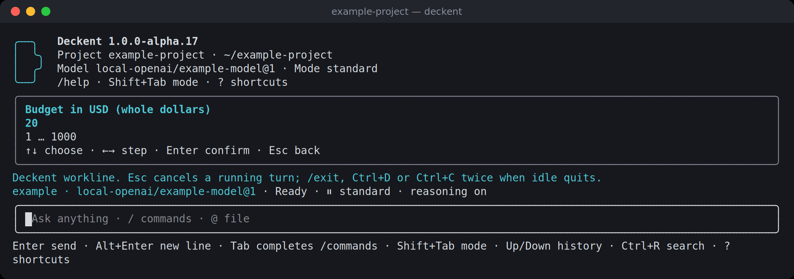<br><sub><b>Another amount.</b> Whole dollars, 1 to 1000; nothing is typed and nothing is sent before you confirm.</sub></td>
  </tr>
  <tr>
    <td width="50%">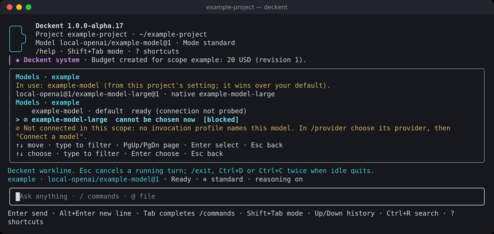<br><sub><b>After the budget.</b> The connected model is ready; the other stays locked until it is connected. The framed line above records the budget.</sub></td>
    <td width="50%">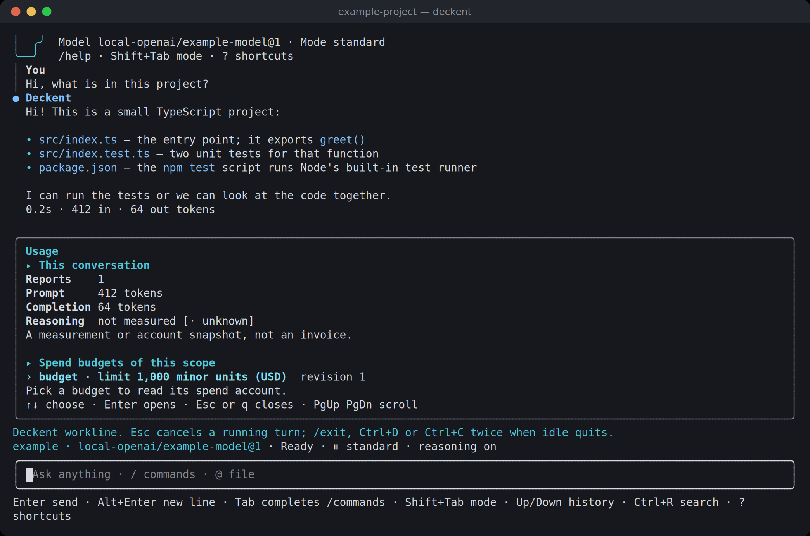<br><sub><b>/usage.</b> Tokens this conversation measured and the scope's budgets. A measurement, not an invoice.</sub></td>
  </tr>
</table>

## In the terminal

These screens come from the real Deckent terminal (alpha.17, 120×36), recorded in a throwaway sample project. The
model is a small test server on the same machine: no provider was called and no real key was used.

Every slash command answers in its own window. <kbd>Esc</kbd> closes it and leaves one framed `Deckent system` line in
the conversation instead of a wall of text. Settings are changed by choosing, not by typing: `/config` walks from
section to key to the allowed values, numbers move with a bounded arrow-key stepper, and only a few fields (such as an
allowed fetch host or a registry address) take typed text, which is checked first. Each change goes through policy and
may become an approval.

<table>
  <tr>
    <td width="50%"><br><sub><b>Chat.</b> Your lines and Deckent's answers are visibly distinct, with time and tokens per turn.</sub></td>
    <td width="50%"><br><sub><b>Approval window.</b> What, where (sandbox), on whose behalf, scope, why, risk, reversibility and a live deadline. <code>y</code> once · <code>n</code> decline · <kbd>Tab</kbd> note.</sub></td>
  </tr>
  <tr>
    <td width="50%"><br><sub><b>/status.</b> A human summary first; identities, process and build under the details.</sub></td>
    <td width="50%"><br><sub><b>Modes.</b> <kbd>Shift</kbd>+<kbd>Tab</kbd> cycles the modes you are allowed; full access is clearly marked.</sub></td>
  </tr>
  <tr>
    <td width="50%"><br><sub><b>/help.</b> Commands grouped by purpose, one line each.</sub></td>
    <td width="50%"><br><sub><b>/mcp.</b> Add a server step by step; configured servers with their trust state.</sub></td>
  </tr>
  <tr>
    <td width="50%">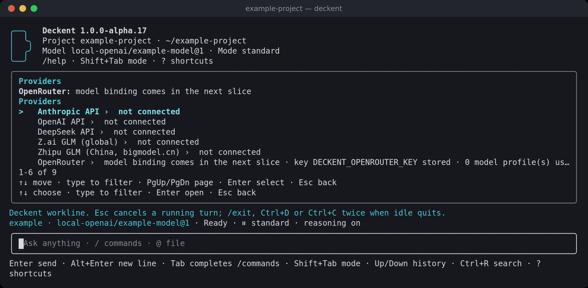<br><sub><b>/provider.</b> Each provider's state; the OpenRouter row says it holds a key only for now.</sub></td>
    <td width="50%">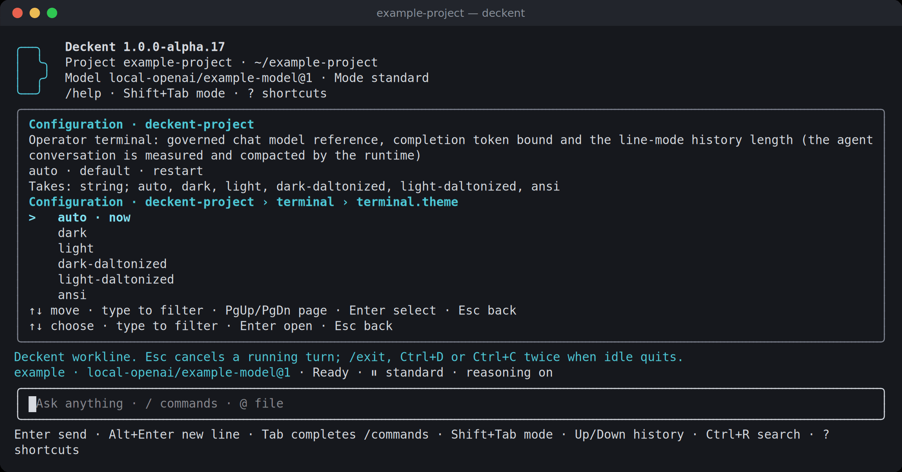<br><sub><b>/config.</b> Section, key, then one of the allowed values; the current one is marked.</sub></td>
  </tr>
  <tr>
    <td width="50%">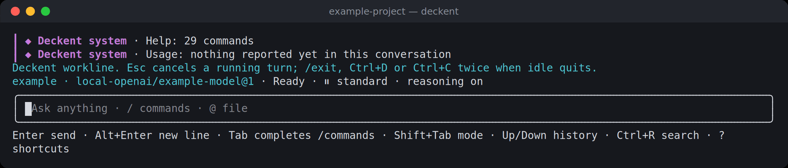<br><sub><b>System lines.</b> Each closed window leaves one framed summary line.</sub></td>
    <td width="50%">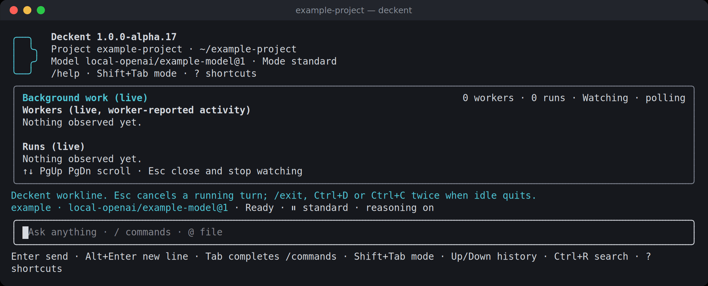<br><sub><b>/tasks.</b> Workers and runs in one live, read-only window (empty here: no background work yet).</sub></td>
  </tr>
</table>

## Safety model

Every tool call an agent makes is decided by two things together: your organization's policy and the permission mode
you chose. You move between the modes you are allowed with <kbd>Shift</kbd>+<kbd>Tab</kbd>, or with `/mode`.

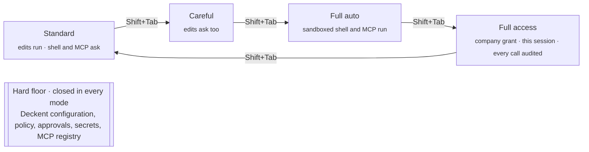

| Mode | Runs without asking | Asks first |
|---|---|---|
| **Standard** | Reads, ordinary file edits | Shell commands, protected paths, MCP calls |
| **Careful** | Reads | Every edit as well |
| **Full auto** | Edits, sandbox-contained shell commands, MCP calls | Destructive commands (`rm -r`, …), protected paths |
| **Full access** | Everything company policy allows above the hard floor; every effect call is audited | The hard floor and whatever company policy still requires (a deny always wins); needs a company grant and lasts for the session |

In standard, careful and full auto, a sandboxed shell command gets a **closed view**: the project is writable, `.git`
is read-only, there is no network and your home directory is hidden. **Full access opens that view on purpose**: the
host file system, your real home directory (with credentials masked), the network and `.git` writes become
available, and only the hard floor stays masked. When no sandbox is usable on a machine, a `prefer-sandbox` realm runs
on the host and says so on every approval card, while a `require-sandbox` realm refuses to run.

### API keys

You store a provider key once, in the masked field of `/provider` or with `deckent secret set NAME` (hidden prompt or
piped stdin, never an argument); a model profile refers to it by name. Never put it in `ANTHROPIC_API_KEY`, a shell
profile or a `.env` file: other tools read those.

| Store (`secrets.store`) | On disk | Who can read the key |
|---|---|---|
| `core.secret-store.env@1` (when no store is selected) | nothing; read from the environment | every program that inherits that environment |
| `core.secret-store.file@1` | plain text, a 0600 file | Deckent and other programs running as your user |
| `core.secret-store.encrypted-file@1` (recommended; fresh installs start here) | encrypted (AES-256-GCM); the unlock key sits in the same folder, no passphrase | Deckent; other programs running as your user can still open it |

Agents and workers never receive a key: the sandbox hides the store and a provider answer that echoes the key is refused.
`deckent doctor` shows which store is active and who can read it. When a provider refuses a key (401/403) or a limit is
reached, the terminal says so in plain words; spend limits stay in your provider account.

**Strict install**, for keys no other program on the machine should read:

Fresh Linux/WSL/macOS installations select the encrypted store through `init policy --apply` and Docker `init apply` when the installed policy permits the switch; existing installations keep their selection.

1. Move your keys into the encrypted store: `deckent secret store` lists the registered stores to pick from; leaving env lists config reference names missing in the target and asks yes/no (scripts require `--confirm-env-missing`); `doctor` shows the same names; it copies every key,
   checks it, selects the new store and then removes the old copy (a move to a weaker store asks first). Installations set up
   with `deckent init policy` on Linux, WSL and macOS start on the encrypted store already.
2. Keep other AI tools out of Deckent's state folder, e.g. `Read` deny rules for the store files in Claude Code's
   `~/.claude/settings.json`. This stops their file tools and common shell commands, not every script.
3. Planned: run the Deckent service under its own OS user (or the macOS Keychain) so no program of your account can read the keys.

The file stores are not available on native Windows yet.

### Spending

Each scope has one shared budget in USD for every API provider. Before a paid call, Deckent reserves the most it could
cost at the dearest price tier that can apply; afterwards it settles the call from the usage the provider itself
reported in its final answer, multiplied by the verified published price. That settled amount is Deckent's own
calculation, not the provider's invoice. A remote model without a verified price is refused and shown locked with
the reason. Where a provider does not say which price tier it used (DeepSeek), the call settles at the published peak
price and is labelled an upper bound. A call that never received its final usage stays held until you resolve it with
`deckent models reconcile-spending`. If a settled charge ever exceeds what was reserved, the scope stops admitting new
calls until you lift the freeze with `deckent models revise-budget --scope <id> --usd <n> --unfreeze`.

## Architecture

Every way in speaks the same typed contract. Runtime-backed operations go through one runtime service, which checks
identity, scope and policy on each operation, writes the result to the ledger and lets effects happen only inside the
place the policy allows. Installation, observation and some patch operations use the same contract locally, without
the service.

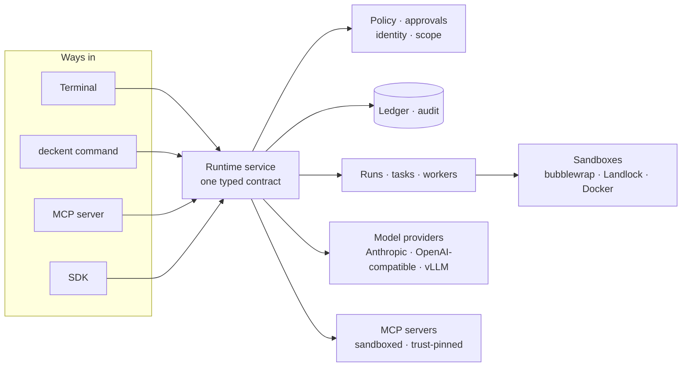

## What you can do today

- **Work with an agent in the terminal**: streamed turns, file edits and a sandboxed shell, approval and monitor
  windows, permission modes, MCP tools, conversation compaction, English and Turkish.
- **Orchestrate work**: admit Runs, Tasks and Attempts, schedule dependencies, reserve capacity, cancel and recover,
  all recorded in a durable SQLite ledger.
- **Use coding workers**: Git-backed checkouts and Docker workers with Claude Code, Codex and Cursor; patches are
  retained, integrated in an isolated candidate, then delivered or released.
- **Govern**: local identity, company-scoped policy, audit and one approval broker for every surface; human
  acceptance or rejection of unverified evidence.
- **Choose models**: a model catalog by client and billing channel, exact activation, local vLLM chat; `/provider` and
  `/model` connect a provider with your own key and pin a model for the session or make it your default; paid calls
  settle from the provider's usage times a verified published tariff under a budget you set in the budget window or
  with `deckent models create-budget` (an unpriced remote model is refused and locked with the reason); spending and
  allocation audit.
- **Back up and restore**: `deckent backup create|verify|restore` writes encrypted, verifiable recovery sets, on a schedule
  if you choose, with retention; a restore runs only while the service is stopped.
- **Operate**: `deckent monitor` for a read-only view of every installation, `deckent doctor` for health, `deckent
  config` for settings, bilingual help everywhere.

Not yet available: autonomous business-process coordination (Mission/`do`), Enterprise SSO and fleet management,
a remote HTTP API, Desktop and Dashboard. A Docker worker shares the host kernel and is not a virtual machine.

## Roadmap

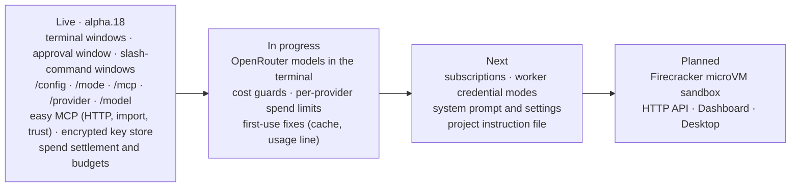

## Get started

Deckent runs on Linux or Windows WSL2 with Node.js ≥ 24.15.0 (Node 24 and 26 are supported); Docker is needed for
coding workers. Until the npm package is published, build it once from source:

```sh
git clone https://github.com/Verhex/deckent-next.git && cd deckent-next
npm ci && npm run build && npm link
```

From then on, everything is `deckent`:

```sh
deckent --version
deckent                                   # open the interactive terminal
deckent doctor                            # installation health
deckent init policy --scope <id> --apply  # first-run policy for a project (see Your first session)
deckent init preview --profile <file>     # preview the installation for a project
deckent mcp add context7 -- npx -y @upstash/context7-mcp   # add an MCP server
deckent monitor                           # watch installations and work
deckent --help                            # every command; deckent <command> --help for details
```

## Learn more

- [ARCHITECTURE.md](ARCHITECTURE.md): contracts, layers and invariants
- [Operator reference](.deckent/docs/architecture/operator-reference.md): worker toolchains, worker images, coding
  profiles, patch custody and installation custody rules
- [CHANGELOG.md](CHANGELOG.md): what each release brought
- [CONTRIBUTING.md](CONTRIBUTING.md) · [Code of Conduct](CODE_OF_CONDUCT.md) · [Security](SECURITY.md)

## License

Apache-2.0 (see [LICENSE](LICENSE)).
