<div align="center">

# Deckent

**The Agent Control & Execution Plane**

Every action by people, AI agents and tools is authorized, isolated, executed and proven inside your own infrastructure.

*policy-driven agent runtime · governed execution · self-hosted agent control plane*

[](https://github.com/Verhex/deckent-next/actions/workflows/ci.yml)
[](LICENSE)
[](package.json)
[](CHANGELOG.md)

[Türkçe](README.tr.md) · [What it is](#what-is-deckent) · [How a request flows](#how-a-request-flows) · [In the terminal](#in-the-terminal) · [Safety](#safety-model) · [Get started](#get-started)

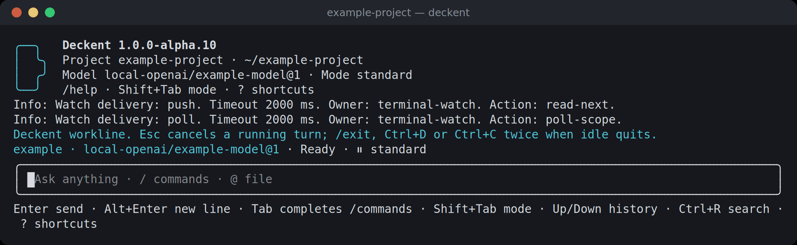

</div>

<!-- Node and pre-release badges read public main package.json, not this local branch.
Keep package.json version and CHANGELOG.md release line together at each release.
npm badges: enable only after the first npm publish. The unscoped name `deckent` is not usable (conflicts with an existing
package); the planned name is the scoped `@verhex/deckent` (owner 2026-10-07, not final). Verify package identity first.
[](https://www.npmjs.com/package/@verhex/deckent)
[](https://www.npmjs.com/package/@verhex/deckent)
-->

> [!NOTE]
> **Pre-release `1.0.0-alpha.10`**, live since 2026-10-07. Deckent is not on npm yet; install it from source
> as shown in [Get started](#get-started). Every release is listed in [CHANGELOG.md](CHANGELOG.md).

## What is Deckent

AI agents can now write code, run commands and call tools on their own. The hard part is no longer *can the agent
do it*, but *should it, where, on whose authority, and how do we know what happened*. Most products answer only half
of that question: some run agents, others govern agents that run somewhere else.

Deckent is both halves in one product, installed on your own machines. Think of an airport: the **control tower**
decides who may take off and records every flight, and the **runway** is where the flight actually happens. Deckent
is the tower and the runway together. It decides what a person or an agent may do, runs that work in an isolated
place, and keeps a durable record you can check afterwards.

You talk to Deckent through its terminal, its `deckent` command, its MCP server or its SDK. All of them use the same
typed contract, so a human click and an agent's tool call go through exactly the same identity, policy and approval
checks. The open-source Core (Apache-2.0) works on its own; the proprietary Enterprise edition layers on top
without changing Core.

| | |
|---|---|
| 🗼 **Govern** | One identity, scope and policy model for people and AI agents. When something needs approval, the window shows exactly what: the full command, where it runs, on whose behalf, the risk, whether it can be undone, and a deadline. A persona or a model's advice never grants authority. |
| 🛫 **Execute** | Runs, tasks and workers are admitted, scheduled and recovered on your machines. Agent shell commands and MCP servers run in sandboxes (bubblewrap, Landlock); workers run in Docker. Works with Anthropic, OpenAI-compatible endpoints, OpenRouter and local vLLM models, and with Claude Code, Codex and Cursor workers. |
| 📜 **Prove** | Every decision and effect lands in a durable ledger and audit trail. Approvals are sealed, patches are retained, and changes are integrated in an isolated candidate before anything is delivered. |

## How a request flows

You ask for something in plain words. Deckent turns it into checked, isolated steps, and nothing runs unless policy
and your permission mode allow it.

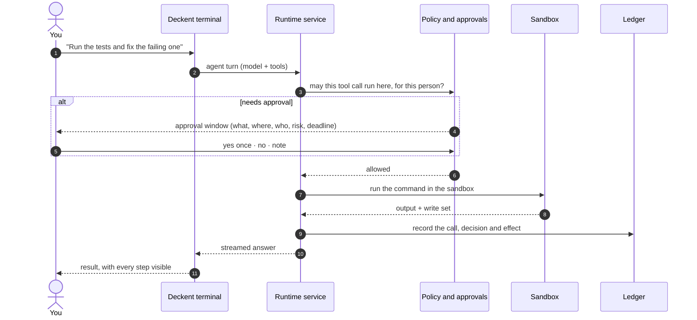

## In the terminal

These screens come from the real Deckent terminal (alpha.10, 110×32), recorded in a throwaway sample project with a
local test model.

<table>
  <tr>
    <td width="50%">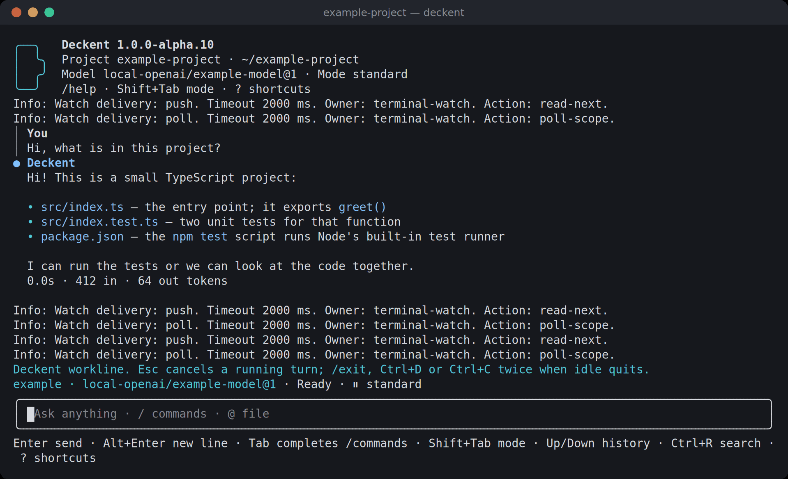<br><sub><b>Chat.</b> Your lines and Deckent's answers are visibly distinct.</sub></td>
    <td width="50%">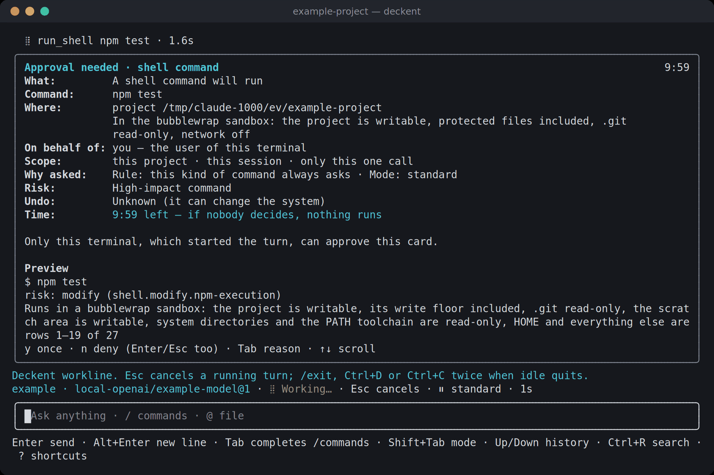<br><sub><b>Approval window.</b> What, where (sandbox), on whose behalf, scope, why, risk, reversibility and a live deadline. <code>y</code> once · <code>n</code> decline · <kbd>Tab</kbd> note.</sub></td>
  </tr>
  <tr>
    <td width="50%">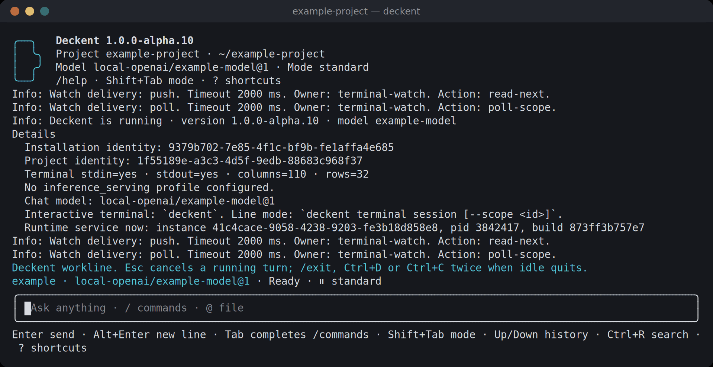<br><sub><b>/status.</b> A human summary first; identities, process and build under the details.</sub></td>
    <td width="50%">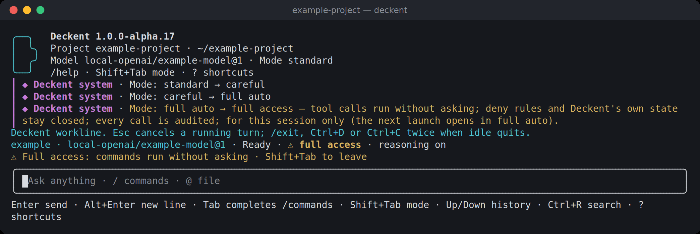<br><sub><b>Modes.</b> <kbd>Shift</kbd>+<kbd>Tab</kbd> cycles the modes you are allowed; full access is clearly marked.</sub></td>
  </tr>
  <tr>
    <td width="50%">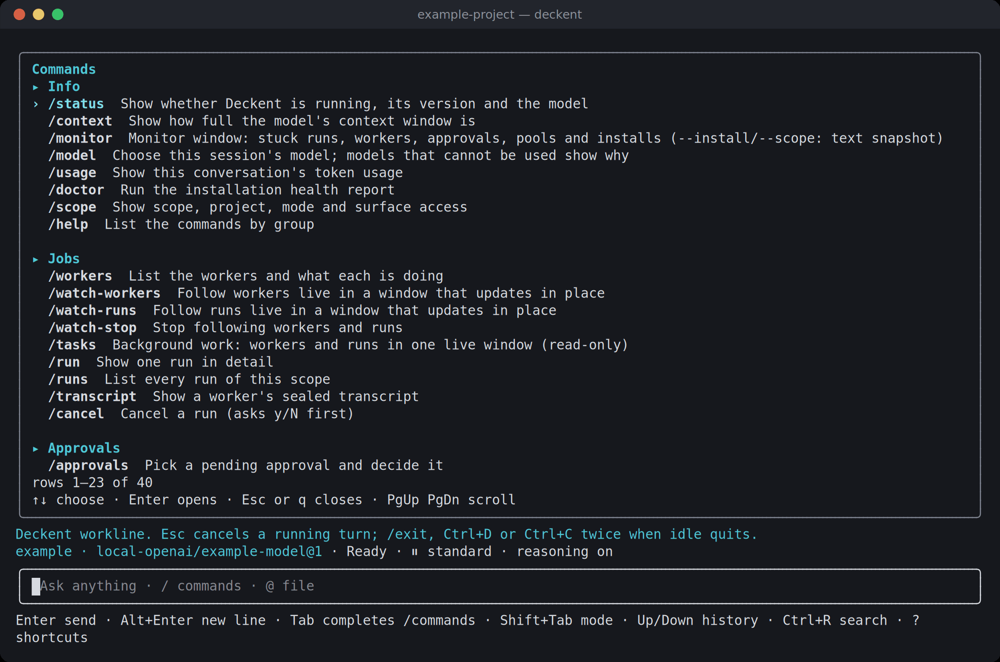<br><sub><b>/help.</b> Commands grouped by purpose, one line each.</sub></td>
    <td width="50%">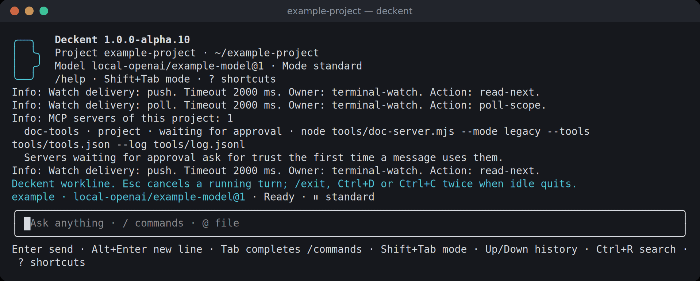<br><sub><b>/mcp.</b> Configured MCP servers, their trust and health.</sub></td>
  </tr>
</table>

## Safety model

Every tool call an agent makes is decided by two things together: your organization's policy and the permission mode
you chose. You move between the modes you are allowed with <kbd>Shift</kbd>+<kbd>Tab</kbd>, or with `/mode`.

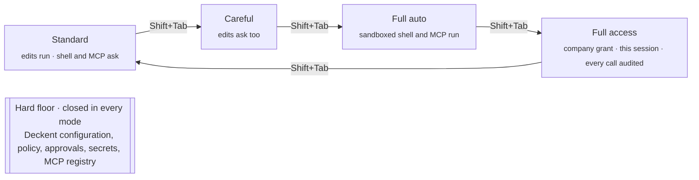

| Mode | Runs without asking | Asks first |
|---|---|---|
| **Standard** | Reads, ordinary file edits | Shell commands, protected paths, MCP calls |
| **Careful** | Reads | Every edit as well |
| **Full auto** | Edits, sandbox-contained shell commands, MCP calls | Destructive commands (`rm -r`, …), protected paths |
| **Full access** | Everything above the hard floor, each call audited | Only the hard floor; needs a company grant and lasts for the session |

Commands that run in the sandbox see your project with `.git` read-only, no network and no home directory. If no
sandbox is available on a machine, Deckent says so on every approval card instead of hiding it.

## Architecture

Every way in reaches one runtime service. It checks identity, scope and policy on each operation, writes the result to
the ledger, and lets effects happen only inside the place the policy allows.

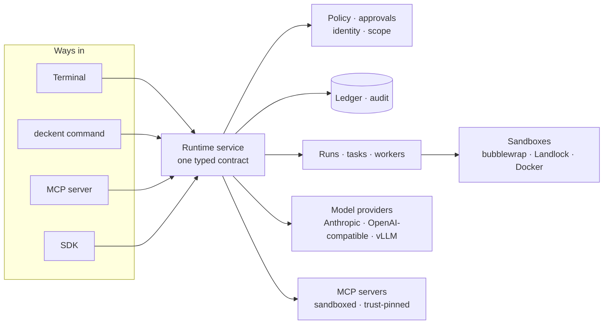

## What you can do today

- **Work with an agent in the terminal**: streamed turns, file edits and a sandboxed shell, approval and monitor
  windows, permission modes, MCP tools, conversation compaction, English and Turkish.
- **Orchestrate work**: admit Runs, Tasks and Attempts, schedule dependencies, reserve capacity, cancel and recover,
  all recorded in a durable SQLite ledger.
- **Use coding workers**: Git-backed checkouts and Docker workers with Claude Code, Codex and Cursor; patches are
  retained, integrated in an isolated candidate, then delivered or released.
- **Govern**: local identity, company-scoped policy, audit and one approval broker for every surface; human
  acceptance or rejection of unverified evidence.
- **Choose models**: a model catalog by client and billing channel, exact activation, spending and allocation audit,
  local vLLM chat.
- **Operate**: `deckent monitor` for a read-only view of every installation, `deckent doctor` for health, `deckent
  config` for settings, bilingual help everywhere.

Not yet available: autonomous business-process coordination (Mission/`do`), Enterprise SSO and fleet management,
a remote HTTP API, Desktop and Dashboard. A Docker worker shares the host kernel and is not a virtual machine.

## Roadmap

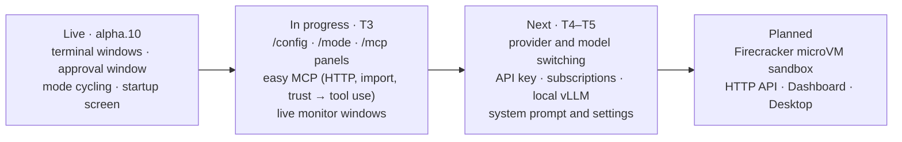

## Get started

Deckent runs on Linux or Windows WSL2 with Node.js ≥ 24.15.0 (Node 24 and 26 are supported); Docker is needed for
coding workers. Until the npm package is published, build it once from source:

```sh
git clone https://github.com/Verhex/deckent-next.git && cd deckent-next
npm ci && npm run build && npm link
```

From then on, everything is `deckent`:

```sh
deckent --version
deckent                                   # open the interactive terminal
deckent doctor                            # installation health
deckent init preview --profile <file>     # preview the installation for a project
deckent mcp add context7 -- npx -y @upstash/context7-mcp   # add an MCP server
deckent monitor                           # watch installations and work
deckent --help                            # every command; deckent <command> --help for details
```

## Learn more

- [ARCHITECTURE.md](ARCHITECTURE.md): contracts, layers and invariants
- [Operator reference](.deckent/docs/architecture/operator-reference.md): worker toolchains, worker images, coding
  profiles, patch custody and installation custody rules
- [CHANGELOG.md](CHANGELOG.md): what each release brought
- [CONTRIBUTING.md](CONTRIBUTING.md) · [Code of Conduct](CODE_OF_CONDUCT.md) · [Security](SECURITY.md)

## License

Apache-2.0 (see [LICENSE](LICENSE)).
