<div align="center">

# Deckent

**Agent Control & Execution Plane**

Deckent, müşterinin kendi altyapısına kurduğu çalışma ortamını, her ücretli API çağrısından önce bütçe tavanını,
sandbox içindeki araçlar ve MCP’yi, policy kontrollü onayları ve insan ile AI girişleri için tek tipli sözleşmeyi birleştirir.

*policy-driven agent runtime · governed execution · self-hosted agent control plane*

[](https://github.com/Verhex/deckent-next/actions/workflows/ci.yml)
[](LICENSE)
[](package.json)
[](CHANGELOG.md)

[English](README.md) · [Deckent nedir](#deckent-nedir) · [Bir istek nasıl akar](#bir-istek-nasıl-akar) · [İlk oturum](#adım-adım-ilk-oturum) · [Terminalde](#terminalde) · [Güvenlik](#güvenlik-modeli) · [Başlarken](#başlarken)

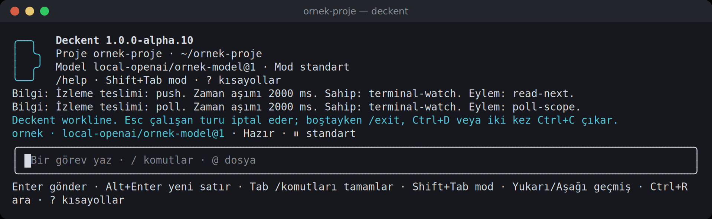

</div>

<!-- Node ve pre-release rozetleri bu yerel dalı değil, public main package.json'u okur.
Her sürümde package.json sürümü ile CHANGELOG.md satırını birlikte güncelleyin.
npm rozetleri: ilk npm yayınından ve paket kimliği doğrulandıktan sonra açılır. Kapsamsız `deckent` adı kullanılamıyor
(mevcut bir paketle çakışıyor); planlanan ad kapsamlı `@verhex/deckent` (önerilen ad; kesinleşmedi).
[](https://www.npmjs.com/package/@verhex/deckent)
[](https://www.npmjs.com/package/@verhex/deckent)
-->

> [!NOTE]
> **Ön sürüm `1.0.0-alpha.23`** (2026-10-09 yayımlandı). Deckent henüz npm'de yok; [Başlarken](#başlarken)
> bölümündeki gibi kaynaktan kurun. Her sürümün içeriği [CHANGELOG.md](CHANGELOG.md) içinde.

## Deckent nedir

Deckent kendi makinelerinizde çalışır; policy, onaylar, yürütme ve kalıcı kayıtları bir araya getirir. Ücretli API
çağrısından önce çağrının tutabileceği en yüksek tutarı kapsamın bütçesinden ayırır; fiyat bilinmiyorsa ya da bütçe
yetmiyorsa çağrıyı reddeder. İnsanlar terminali veya `deckent` komutunu, AI ajanları ve entegrasyonlar MCP veya SDK’yı
kullanır. Bu giriş yolları tek tipli uygulama sözleşmesini paylaşır.

MCP, varsayılanı yalnız gözlem olan ayrı bir aktör kullanır; bütçe değiştirmek, model etkinleştirmek veya çağırmak o MCP
aktörünü adıyla anan açık bir policy izni ister. İnsan onay kararları etkileşimli terminal girişi ve çıkışı gerektirir.

Açık kaynak Core (Apache-2.0) tek başına çalışır. Ayrı dağıtılacak proprietary Enterprise sürümü, Core'u değiştirmeden
kayıt defteri (registry) üzerinden üstüne katmanlanacak şekilde tasarlanmıştır. Bugün public uzantı girişi, CLI
dağıtımının etki adaptörleri ve gizli depo adaptörleri kaydetmesini sağlar. alpha.20’den beri aynı dağıtım,
kayıtlarıyla servis ve MCP girişini de başlatabilir; otomatik servis başlatma ve yeniden başlatma dağıtımın girişini
yeniden çalıştırır. Core'un yalın çalıştırılabilir dosyaları bu modülleri kendiliğinden keşfetmez. Enterprise SSO, ERP
entegrasyonları ve filo yönetimi planlanan yeteneklerdir.

| | |
|---|---|
| 🗼 **Yönetir** | İnsanlar ve yapay zekâ ajanları için tek kimlik, kapsam ve policy modeli. Bir iş onay isterse pencere neyin onaylandığını tam gösterir: tam komut, nerede çalışacağı, kimin adına, risk, geri alınıp alınamayacağı ve süre. Persona ya da model tavsiyesi asla yetki vermez. |
| 🛫 **Yürütür** | İşler (Run), görevler ve işçiler sizin makinelerinizde kabul edilir, sıralanır ve kurtarılır. Ajanın kabuk komutları ve MCP sunucuları sandbox içinde (bubblewrap, Landlock), işçiler Docker'da çalışır. Anthropic, OpenAI, DeepSeek, Z.ai (GLM), yerel sunucu veya fiyatı yayımlanmış OpenAI uyumlu uç noktalar ve OpenRouter model bağlantılarıyla (ücretli çağrı için fiyat ve yönlendirme doğrulanmalı); Claude Code, Codex ve Cursor işçileriyle çalışır. |
| 📜 **Kanıtlar** | Her karar ve etki kalıcı bir defter ve denetim izine yazılır. Onaylar mühürlenir, yamalar saklanır ve değişiklikler teslimden önce yalıtılmış bir adayda birleştirilir. |

## Bir istek nasıl akar

İsteğinizi düz bir cümleyle söylersiniz. Deckent bunu kontrol edilmiş, yalıtılmış adımlara çevirir; policy ve izin
modunuz izin vermedikçe hiçbir şey çalışmaz.

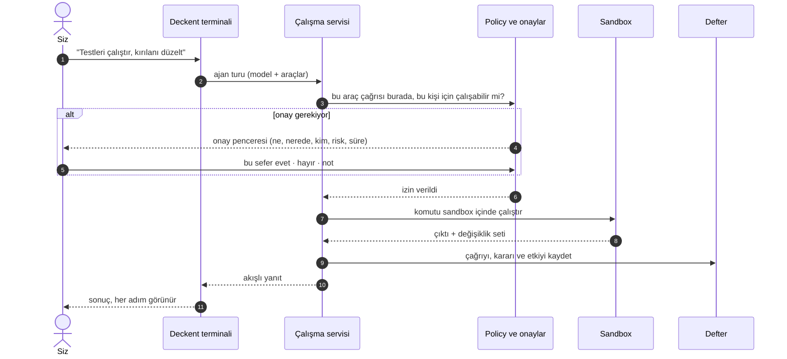

## Adım adım ilk oturum

Boş bir projeden yönetilen bir ajan turuna ve onun maliyetine kadar, Deckent'ten çıkmadan:

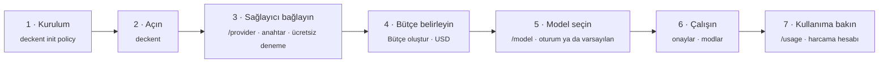

**Kapsam (scope)**, yetki politikasını, iş kayıtlarını ve harcamayı bu projeye bağlayan sabit kimliktir.
`--scope my-project` bir dizini veya yalıtım ortamını değil, bu kimliği seçer. Yeni projede ilk politikayı
önizlerken bir kimlik seçin; mevcut kurulumda ayarlarda tanımlı kapsam kimliğini kullanın. Sonraki
komutlarda aynı kimliği kullanın. Terminalin varsayılanı `terminal.scopeId` değeridir; bu kapsamı
açıkça seçmek için `deckent --scope my-project` ile açın. Kapsam ve yürütme ortamı tanımları için
[sözlüğe](docs/glossary.tr.md) bakın.

```sh
deckent init policy --scope my-project --preview
deckent init policy --scope my-project --apply
```

1. **Kurulum**, proje başına bir kez: `deckent init policy --scope <id> --preview` ilk kurulum policy'sini gösterir,
   `deckent init policy --scope <id> --apply` onu kurar, varsayılan terminal kapsamını ve sohbet sınırlarını
   yazar; iptal ayarlarını ve göçü tamamlanmış boş ledger’ı oluşturur. Örneğin kapsam adı olarak `my-project` seçin. Bu policy o kapsamda model bağlamanıza ve çağırmanıza,
   anahtar saklamanıza ve bütçe belirlemenize izin verir; bu eylemlerin her biri yine kontrol edilir ve kaydedilir.
   Linux, WSL ve macOS'ta yeni bir kurulum şifreli anahtar deposuyla başlar.
2. **Terminali açın**: `deckent` (kapsamı açıkça seçmek için `deckent --scope my-project`).
3. **Sağlayıcı bağlayın**: `/provider` ile Anthropic API, OpenAI API, DeepSeek API, Z.ai GLM, vLLM gibi yerel
   bir sunucu veya fiyatı yayımlanmış OpenAI uyumlu bir uç nokta. Anahtarı gizlenen bir alana yazarsınız;
   Deckent onu ücretsiz bir istekle dener ve gizli depoya adıyla saklar; denemenin reddettiği anahtar asla
   saklanmaz. Ücretsiz denemesi olmayan bir sağlayıcıda anahtar doğrulanmadan saklanır ve olası reddi ilk tur
   gösterir. Değer bir daha gösterilmez ve hiçbir ajan ya da işçi onu almaz. Ardından **Model bağla**'yı seçin.
   Paketlenmiş kataloğu olan sağlayıcılar o modelleri sunar; kataloğu olmayanlarda önce adresi, sonra sınırlı
   `/v1/models` listesinden birebir model kimliğini seçersiniz. Deckent bu kimliği aynen saklar. Bu makinedeki
   yerel modeller ücretsiz ölçülür; yayımlanmış fiyatı doğrulanmamış uzak model, nedeni ve sonraki adımıyla
   kilitli görünür (Zhipu GLM Çin, fiyatları CNY olduğu için kilitli kalır). OpenRouter model bağlantıları
   sunar; ücretli çağrı için fiyat ve yönlendirme yine doğrulanmalıdır. Aynısı komut satırından: `deckent secret
   set <AD>` ve `deckent models connect --scope <id> --connection <tür> --command-id <id> --model <birebir
   kimlik>`.
4. **Bütçe belirleyin.** Her model turu, kapsamın tek ve ortak USD bütçesinden pay ayırır; bütçe yoksa her tur
   reddedilir ve pencereler bunu söyler. `/provider`'ın ilk satırı **Bütçe oluştur** bütçe penceresini açar: 5, 10, 25,
   50 ya da 100 USD veya ok tuşlarıyla 1 ile 1000 arasında başka bir tam dolar tutarı, ardından bir onay adımı. Sonra
   aynı satır **Bütçeyi değiştir** olur. Komut satırından: `deckent models create-budget --scope <id> --usd <n>` ve
   `deckent models revise-budget --scope <id> --usd <n>`.
5. **Model seçin**: `/model` katalogdaki modelleri listeler; henüz kullanamayacağınız bir model nedeniyle (bütçe yok,
   bağlı değil, anahtar eksik, etkin değil) ve onu neyin düzelteceğiyle kilitlidir. **Yalnız bu oturum** ya da **Bu
   oturum ve varsayılanım olsun** (sizin `terminal.defaultModel` ayarınız) seçin. Proje kendi modelini belirtiyorsa
   pencere kullanılan modeli hangi ayarın seçtiğini söyler.
6. **Çalışın.** İsteğinizi düz cümleyle söyleyin. Araç çağrıları şirket policy'nize ve izin modunuza uyar; size
   danışılması gereken her şey onay penceresini açar (bkz. [Güvenlik modeli](#güvenlik-modeli)).
7. **Kullanıma bakın**: `/usage` bu konuşmanın ölçtüğü token'ları (sağlayıcı bildirmediyse akıl yürütme *ölçülmedi*
   görünür) ve kapsamın bütçelerini gösterir; harcama hesabını okumak için bir bütçe açın: üst sınır, ayrılan ve
   kesinleşen.

<table>
  <tr>
    <td width="50%">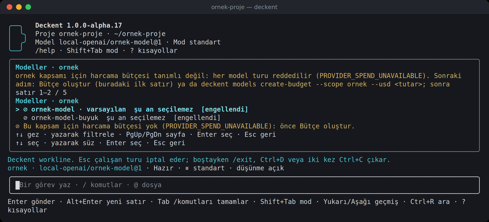<br><sub><b>Bütçeden önce.</b> <code>/model</code> her modeli kilitler; nedeni ve sonraki adımı söyler.</sub></td>
    <td width="50%">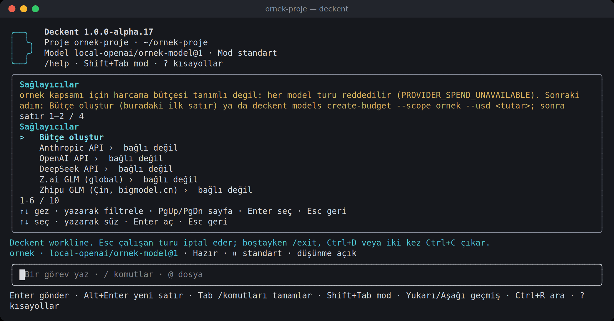<br><sub><b>/provider.</b> Önce <b>Bütçe oluştur</b>, sonra her sağlayıcı bağlantı durumuyla.</sub></td>
  </tr>
  <tr>
    <td width="50%">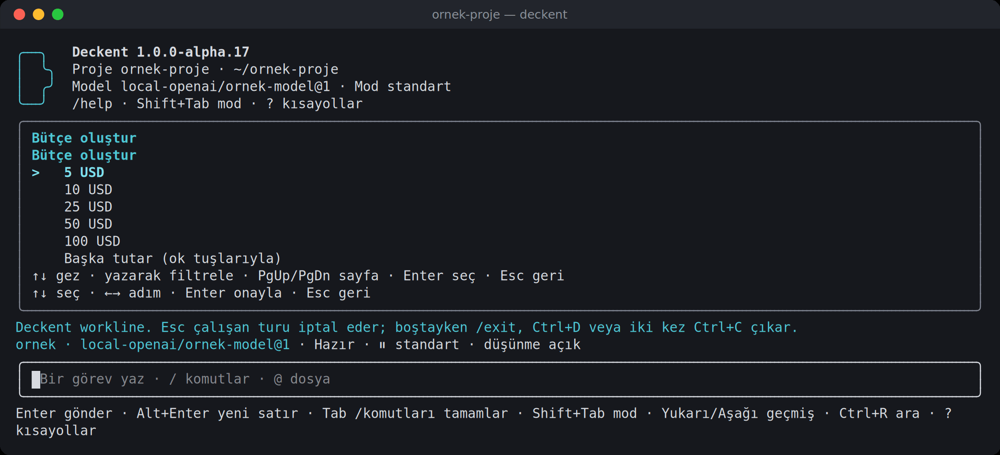<br><sub><b>Bütçe penceresi.</b> Hazır tutarlar ya da ok tuşlarıyla başka bir tutar.</sub></td>
    <td width="50%">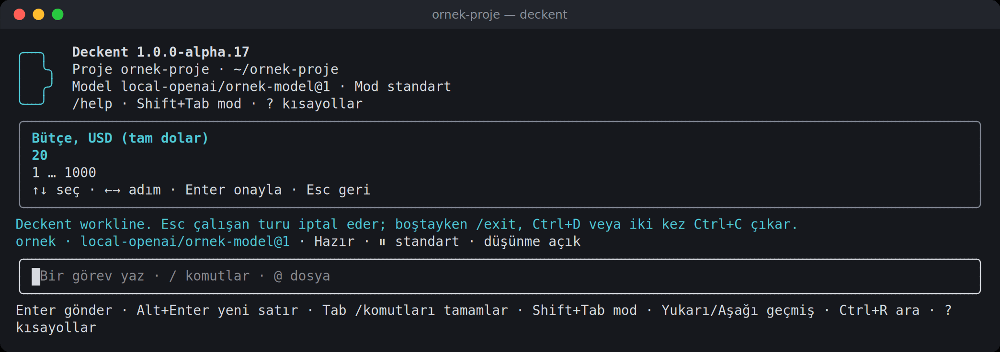<br><sub><b>Başka tutar.</b> Tam dolar, 1 ile 1000 arası; hiçbir şey yazılmaz, onaylamadan hiçbir şey gönderilmez.</sub></td>
  </tr>
  <tr>
    <td width="50%">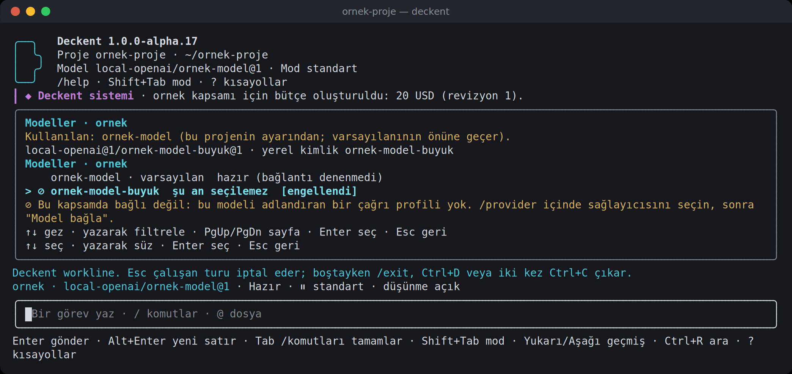<br><sub><b>Bütçeden sonra.</b> Bağlı model hazır; diğeri bağlanana kadar kilitli kalır. Üstteki çerçeveli satır bütçeyi kaydeder.</sub></td>
    <td width="50%">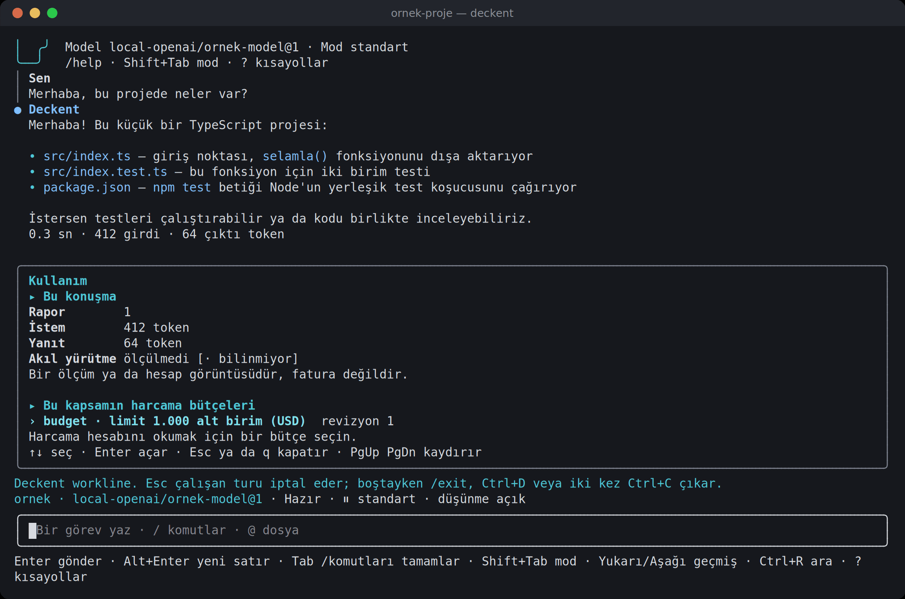<br><sub><b>/usage.</b> Bu konuşmanın ölçtüğü token'lar ve kapsamın bütçeleri. Fatura değil, ölçümdür.</sub></td>
  </tr>
</table>

## Terminalde

Bu ekranlar gerçek Deckent terminalinden (alpha.17, 120×36), geçici bir örnek projede çekildi. Model, aynı makinedeki
küçük bir deneme sunucusudur: hiçbir sağlayıcı çağrılmadı ve gerçek bir anahtar kullanılmadı.

Her slash komutu kendi penceresinde yanıt verir. <kbd>Esc</kbd> pencereyi kapatır ve konuşmada metin yığını yerine
tek bir çerçeveli `Deckent sistemi` satırı bırakır. Ayarlar yazarak değil seçerek değişir: `/config` bölümden anahtara,
oradan izin verilen değerlere ilerler; sayılar sınırlı bir ok tuşu adımlayıcısıyla değişir ve yalnız birkaç alan
(izinli bir fetch adresi ya da bir kayıt defteri adresi gibi) yazılan metin alır, o da önce kontrol edilir. Her
değişiklik policy'den geçer ve bir onaya dönüşebilir.

<table>
  <tr>
    <td width="50%">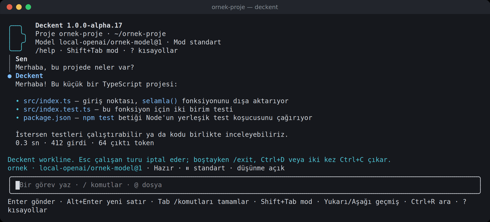<br><sub><b>Sohbet.</b> Sizin satırlarınız ve Deckent'in yanıtları belirgin biçimde ayrışır; her turda süre ve token.</sub></td>
    <td width="50%">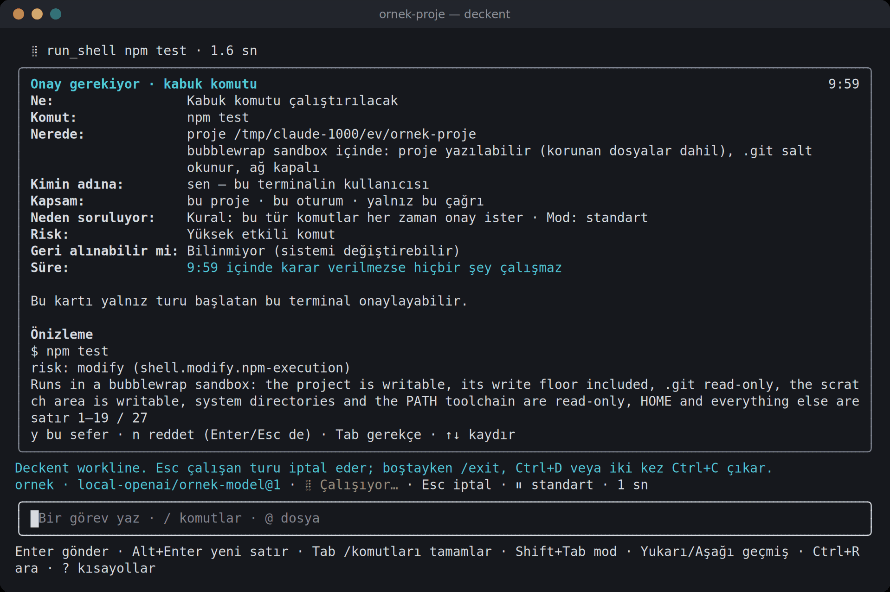<br><sub><b>Onay penceresi.</b> Ne, nerede (sandbox), kimin adına, kapsam, neden, risk, geri alınabilirlik ve canlı süre. <code>y</code> bu sefer · <code>n</code> reddet · <kbd>Tab</kbd> not.</sub></td>
  </tr>
  <tr>
    <td width="50%">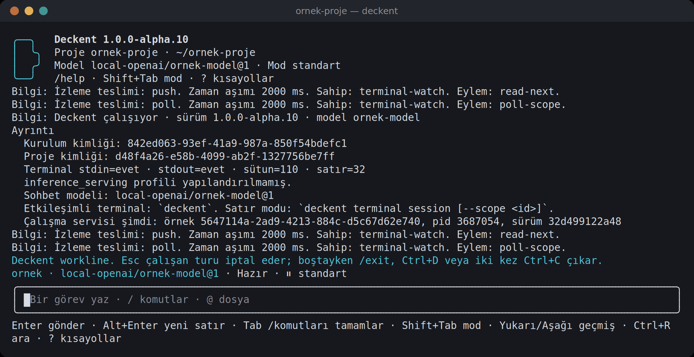<br><sub><b>/status.</b> Önce insan dilinde özet; kimlikler, süreç ve build ayrıntıda.</sub></td>
    <td width="50%">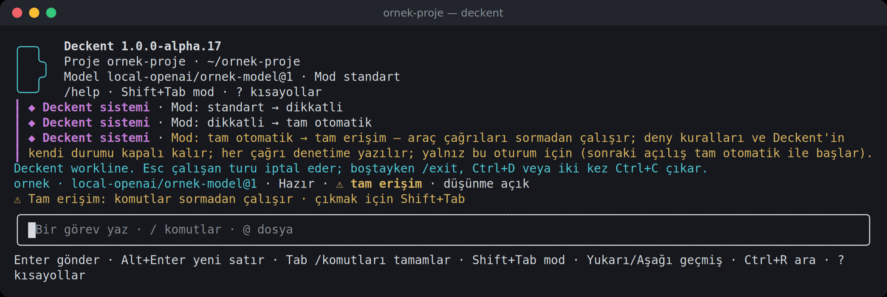<br><sub><b>Modlar.</b> <kbd>Shift</kbd>+<kbd>Tab</kbd> yetkili olduğunuz modlar arasında döner; tam erişim açıkça işaretlenir.</sub></td>
  </tr>
  <tr>
    <td width="50%">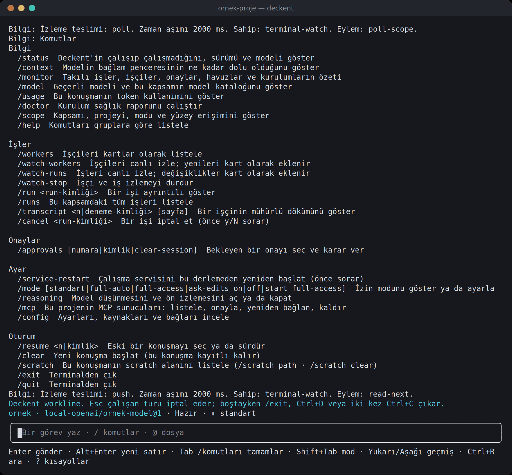<br><sub><b>/help.</b> Komutlar amaca göre gruplu, her biri tek satır.</sub></td>
    <td width="50%">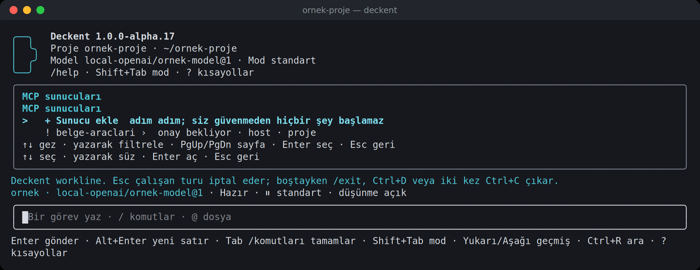<br><sub><b>/mcp.</b> Adım adım sunucu ekleme; yapılandırılmış sunucular güven durumlarıyla.</sub></td>
  </tr>
  <tr>
    <td width="50%">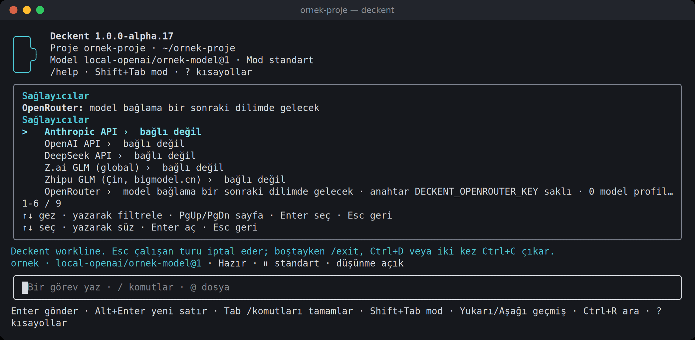<br><sub><b>/provider.</b> Her sağlayıcının durumu. OpenRouter artık model bağlantıları sunar; bu ekran görüntüsü o değişiklikten öncedir.</sub></td>
    <td width="50%">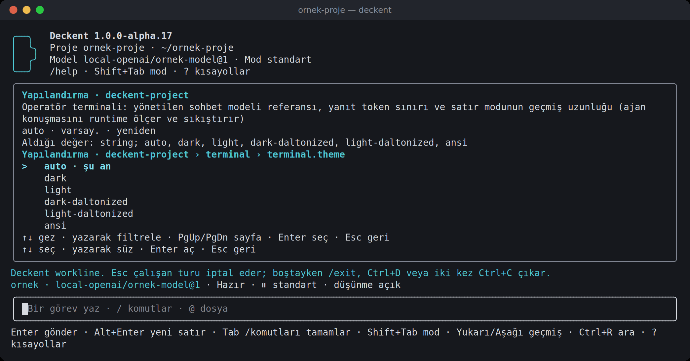<br><sub><b>/config.</b> Bölüm, anahtar, sonra izin verilen değerlerden biri; geçerli olan işaretli.</sub></td>
  </tr>
  <tr>
    <td width="50%">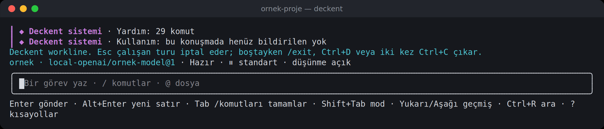<br><sub><b>Sistem satırları.</b> Kapanan her pencere tek bir çerçeveli özet satırı bırakır.</sub></td>
    <td width="50%">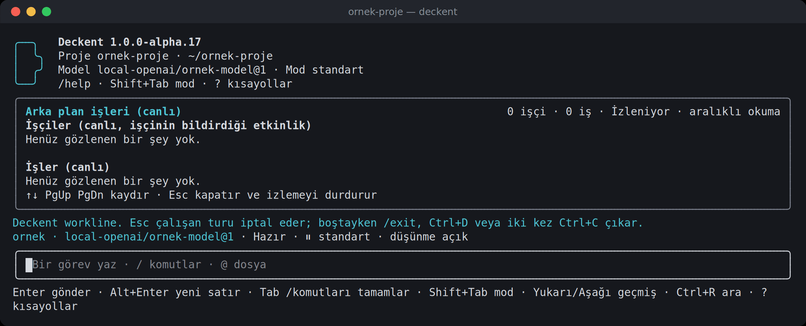<br><sub><b>/tasks.</b> İşçiler ve işler tek bir canlı, salt okunur pencerede (burada boş: henüz arka plan işi yok).</sub></td>
  </tr>
</table>

## Güvenlik modeli

Dış MCP istemcileri başlangıçta yalnız gözlem izni alır. **MCP izinleri** için `/policy` penceresini açıp mevcut kapsamı ve yetki grubunu seçin; değişecek kuralları inceleyip izin verin ya da kaldırın. Uygulama doğrulanmış terminal onayı ister ve denetim kaydına alınır; `policy.json` dosyasına kural yazmanız gerekmez. Havuz yönetimi, katalog kaydı ve genel model yapılandırması **tüm kapsamlar** olarak gösterilir. Grup iznini kaldırmak başka izinleri silmez; araç bu izinlerle açık kalabilir. “Dogfood çalışanı” yalnız iş yetkilerini içeren bir öneridir; kesin N1 MCP kullanımı doğrulanmadı.

CLI seçeneklerini `deckent policy mcp list --json` listeler:

```sh
deckent policy mcp grant --group work --scope <mevcut-kapsam> --preview
deckent policy mcp grant --group work --scope <mevcut-kapsam> \
  --apply --expect <önizleme-özeti>
# Kaldırma: aynı iki adımda `grant` yerine `revoke` kullanın.
```


Ajanın yaptığı her araç çağrısına iki şey birlikte karar verir: kurumunuzun policy'si ve seçtiğiniz izin modu.
Yetkili olduğunuz modlar arasında <kbd>Shift</kbd>+<kbd>Tab</kbd> ya da `/mode` ile geçersiniz.

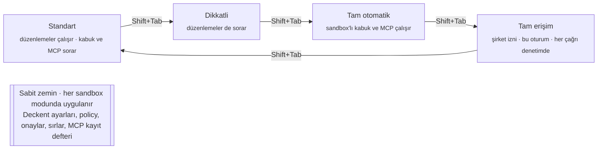

| Mod | Sormadan çalışır | Önce sorar |
|---|---|---|
| **Standart** | Okumalar, sıradan dosya düzenlemeleri | Kabuk komutları, korunan yollar, MCP çağrıları |
| **Dikkatli** | Okumalar | Her düzenleme de |
| **Tam otomatik** | Düzenlemeler, sandbox içinde kalan kabuk komutları, MCP çağrıları | Yıkıcı komutlar (`rm -r`, …), korunan yollar |
| **Tam erişim** | Şirket policy'sinin sabit zeminin üstünde izin verdiği her şey; her etkili çağrı denetime yazılır | Sabit zemin ve şirket policy'sinin hâlâ istediği onaylar (deny her zaman kazanır); şirket izni gerekir ve oturum boyunca geçerlidir |

Standart, dikkatli ve tam otomatik modlarda sandbox'taki kabuk komutu **kapalı bir görünüm** alır: proje, çağrının onay
kuralları içinde yazılabilir; `.git` salt okunur, ağ kapalıdır ve ev klasörünüz gizlidir. Onaylanan komutlar da Deckent'in
yetki dosyalarını değiştiremez. Landlock ayrıca izin ve sahiplik değişikliklerini reddeder; korunan yolları tutan
dizinlerde giriş eklemeyi veya silmeyi de kısıtlar.
Tam erişim, kullanılabilir bir **açık bubblewrap sandbox'ı** gerektirir: ağ ve ev klasörü açılır; Deckent durumu, ayarlar,
kimlik bilgisi kalıpları ve host Docker/oturum D-Bus soketleri maskeli ya da salt okunur kalır. Açık sandbox yoksa tam
erişim kabuk çağrıları, `host` seçilmiş olsa bile reddedilir. Kapalı modlarda `prefer-sandbox` açık bir bildirimle host'a
düşebilir; bu yol dosya sistemi sınırı uygulamaz. Yalıtım gerekiyorsa `require-sandbox` seçin.
Ortak kimlik bilgisi kataloğu gh, Docker, kube, Codex, Git ve yaygın bulut CLI'larını kapsar. Ev klasörü taraması sınırlıdır
(3 derinlik, 20.000 giriş); özel konumlar, farklı dosya adları ve maskelerin dışındaki takma yollar ayrıca yalıtılmalıdır.
Tam otomatik, `find -delete`, dosya kısaltma (`>`, `>|`) ve taşıma (`mv`) için onay ister; ekleme (`>>`) değişiklik sayılır.

### API anahtarları

Sağlayıcı anahtarını bir kez, `/provider`'ın gizlenen alanına ya da `deckent secret set AD` ile kaydedersiniz (gizli
istem ya da stdin; asla komut argümanı değil); model profili ona adıyla başvurur. Anahtarı `ANTHROPIC_API_KEY`, shell
profili ya da `.env` dosyasına koymayın: başka araçlar oraları okur.

| Depo (`secrets.store`) | Diskte | Anahtarı kim okuyabilir |
|---|---|---|
| `core.secret-store.env@1` (hiçbir depo seçilmemişse) | hiçbir şey; ortam değişkeninden okunur | o ortamı devralan her program |
| `core.secret-store.file@1` | düz metin, 0600 dosya | Deckent ve sizin hesabınızla çalışan diğer programlar |
| `core.secret-store.encrypted-file@1` (önerilen; yeni kurulumlar bununla başlar) | şifreli (AES-256-GCM); açma anahtarı aynı klasörde, parola yok | Deckent; sizin hesabınızla çalışan diğer programlar yine açabilir |

Ajan ve worker istekleri anahtara adıyla başvurur; çalışma zamanı anahtarı isteme veya shell ortamına koymadan çözer.
Desteklenen sandbox'lar depoyu gizler; host'a düşen yol dosya sistemi yalıtımı sağlamaz. Anahtarı geri yansıtan sağlayıcı
yanıtı reddedilir.
`deckent doctor` hangi deponun etkin olduğunu ve kimin okuyabileceğini gösterir. Sağlayıcı anahtarı reddederse (401/403) ya da
bir limit dolarsa terminal bunu açık sözlerle söyler; harcama limitleri sağlayıcı hesabınızda kalır.

**Katı kurulum**, anahtarı makinedeki başka hiçbir programın okumaması gerekiyorsa:

1. Anahtarlarınızı şifreli depoya taşıyın: `deckent secret store` kayıtlı depoları seçmeniz için listeler; her anahtarı kopyalar,
   doğrular, yeni depoyu seçer ve ardından eski kopyayı siler (daha zayıf bir depoya geçiş önce sorar). Linux, WSL ve macOS'ta
   `deckent init policy` ile kurulanlar zaten şifreli depoyla başlar.
2. Diğer yapay zekâ araçlarını Deckent'in durum klasöründen uzak tutun; örneğin Claude Code'un `~/.claude/settings.json`
   dosyasında depo dosyaları için `Read` yasak kuralları. Bu, dosya araçlarını ve yaygın shell komutlarını durdurur, her betiği değil.
3. Planlanan: Deckent servisini ayrı bir işletim sistemi kullanıcısında (ya da macOS Keychain ile) çalıştırmak; böylece hesabınızdaki hiçbir program anahtarları okuyamaz.

Dosya depoları native Windows'ta henüz yok.

### Harcama

Her kapsamın, tüm API sağlayıcıları için ortak tek bir USD bütçesi vardır. Ücretli bir çağrıdan önce Deckent, geçerli
olabilecek en pahalı fiyat kademesinde çağrının tutabileceği en yüksek tutarı ayırır; sonra çağrıyı sağlayıcının kendi
son yanıtında bildirdiği kullanım ile doğrulanmış yayımlanmış fiyatın çarpımından kesinleştirir. Kesinleşen tutar
Deckent'in kendi hesabıdır, sağlayıcının faturası değildir. Fiyatı doğrulanmamış uzak bir model reddedilir ve nedeniyle
kilitli görünür. Sağlayıcı hangi fiyat kademesini kullandığını söylemiyorsa (DeepSeek) çağrı yayımlanmış en yüksek
fiyattan kesinleşir ve üst sınır olarak işaretlenir. Son kullanımını hiç almamış bir çağrı, `deckent models
reconcile-spending` ile çözene kadar ayrılmış kalır. Kesinleşen bir tutar ayrılandan fazla çıkarsa kapsam yeni
çağrıları kabul etmez; dondurmayı `deckent models revise-budget --scope <id> --usd <n> --unfreeze` ile kaldırırsınız.

## Mimari

Her giriş yolu aynı tipli sözleşmeyi konuşur. Çalışma servisine bağlı işlemler tek bir çalışma servisinden geçer;
servis her işlemde kimliği, kapsamı ve policy'yi kontrol eder, sonucu deftere yazar ve etkilerin yalnız policy'nin
izin verdiği yerde olmasına izin verir. Kurulum, gözlem ve bazı yama işlemleri aynı sözleşmeyi servis olmadan yerelde
kullanır.

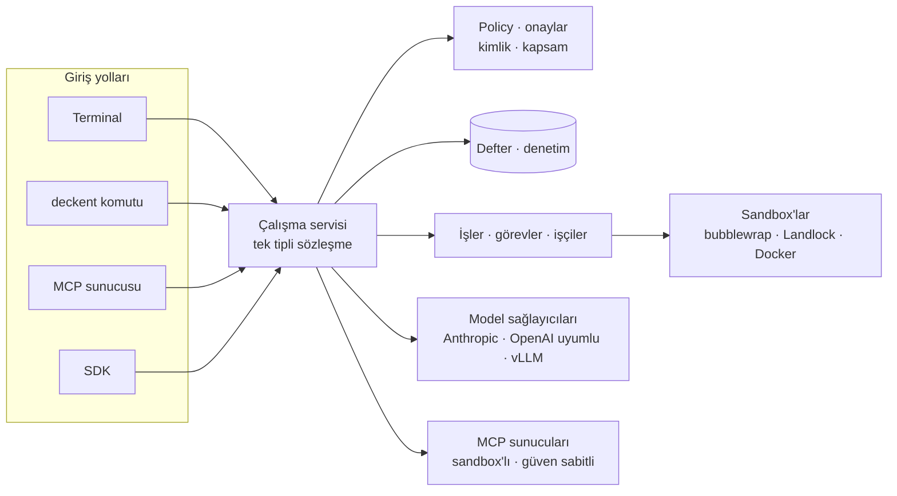

## Bugün neler yapabilirsiniz

- **Terminalde ajanla çalışın**: akışlı turlar, dosya düzenleme ve sandbox'lı kabuk, onay ve izleme pencereleri,
  izin modları, MCP araçları, konuşma sıkıştırma, Türkçe ve İngilizce.
- **İşleri yönetin**: yürütme (Run), görev (Task) ve deneme (Attempt) kabul edin, bağımlılıkları sıralayın, kapasite ayırın, iptal edin ve
  kurtarın; hepsi kalıcı bir SQLite defterine yazılır.
- **Kodlama işçileri kullanın**: Git tabanlı çalışma kopyaları ve Claude Code, Codex, Cursor ile Docker işçileri;
  yamalar saklanır, yalıtılmış bir adayda birleştirilir, sonra teslim edilir ya da yayınlanır.
- **Yönetişim**: yerel kimlik, şirket kapsamlı policy, denetim ve her yüzey için tek onay aracısı; doğrulanmamış
  kanıt için insan kabulü ya da reddi.
- **Model seçin**: istemci ve faturalama kanalına göre model kataloğu, birebir etkinleştirme, yerel vLLM sohbeti;
  `/provider` ve `/model` kendi anahtarınızla sağlayıcı bağlar, modeli oturum için sabitler ya da varsayılanınız yapar;
  ücretli çağrılar, sağlayıcının kullanım verisi ile doğrulanmış yayımlanmış tarifenin çarpımından, bütçe penceresinde
  ya da `deckent models create-budget` ile belirlediğiniz bütçe altında kesinleşir (fiyatı bilinmeyen uzak model
  reddedilir ve nedeniyle kilitlenir); harcama ve ayırma denetimi.
- **Önbellekle maliyeti izleyin**: yeni Anthropic profilleri 5 dakikalık istem önbelleğini kullanır, mevcut profiller
  yalnızca sizin seçiminizle değişir; `/usage` canlı hesabı USD olarak, önbellek okuma ve yazmalarını ve tahmini net
  kazancı gösterir.
- **Terminalde OpenRouter modelleri kullanın**: `/provider` ile kendi anahtarınızı bağlayın; araç ve akış çalışır,
  OpenRouter'ın bildirdiği her çağrı ücreti bütçenize kesinleşir.
  İlk ücretli OpenRouter çağrısından önce https://openrouter.ai/settings/plugins sayfasında hiçbir eklentinin
  "Prevent overrides" ile açık olmadığını kontrol edin ve OpenRouter kredi sınırını Deckent bütçenizden yüksek olmayacak
  şekilde ayarlayın; Deckent bu iki ayarı göremez.
- **Yedekleyin ve geri yükleyin**: `deckent backup create|verify|restore` şifreli, doğrulanabilir kurtarma kümeleri yazar;
  isterseniz zamanlayarak ve saklama süresiyle; geri yükleme yalnızca servis durmuşken çalışır.
- **İşletin**: tüm kurulumlar için salt okunur `deckent monitor`, sağlık için `deckent doctor`, ayarlar için
  `deckent config`, her yerde iki dilli yardım.

Henüz yok: otonom iş süreci koordinasyonu (Mission/`do`), Enterprise SSO ve filo yönetimi, uzak HTTP API, masaüstü ve
web paneli. Docker işçisi host çekirdeğini paylaşır; sanal makine değildir.

## Yol haritası

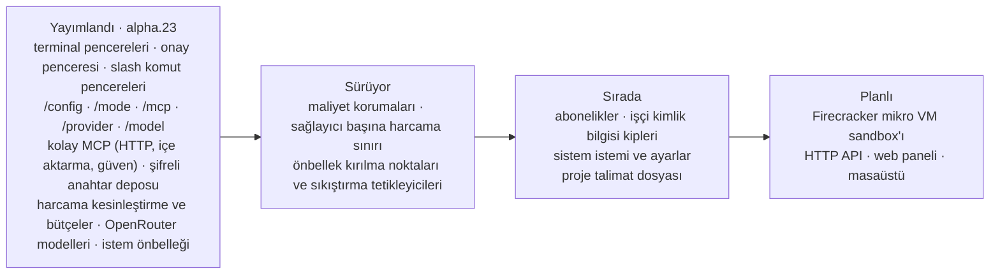

## Başlarken

Deckent Linux veya Windows üzerinde WSL2 ile, Node.js ≥ 24.15.0 kullanarak çalışır (Node 24 ve 26 desteklenir).
Native Windows runtime taşıması desteklenmez. Yeni kaynak derlemesi, kilitli bubblewrap’ı (şu an 0.13.0)
derleyip yerleştirmek için Docker ister; kilitli kaynağı indirir, kaynak ve binary özetlerini doğrular.
Doğrulanmış hazır paket çevrimdışı yeniden kullanılabilir. Sistem bubblewrap seçilirse sürümü en az 0.12.0
olmalıdır. Kodlama işçileri de Docker ister; ilk terminal oturumu Docker veya ücretli çağrı gerektirmez.
Native yalıtım yardımcısı için C derleme araçları da gerekir.
npm paketi yayımlanana kadar bir kez kaynaktan derleyin:

```sh
git clone https://github.com/Verhex/deckent-next.git
cd deckent-next
npm ci
node scripts/build-bwrap.mjs --arch all --out .pack/bwrap/first-build
node scripts/build-bwrap.mjs --stage-dev .pack/bwrap/first-build
npm run build
npm link
```

Sonraki build için yeni bir `--out` dizini kullanın. Build `bubblewrap=ABSENT` diyorsa yalıtım gerektiren
işe geçmeyin; `deckent doctor` ile yalıtım durumunu inceleyin. Ön koşullar ve sağlayıcı anahtarı
gerektirmeyen tek test için [katkıcı hızlı başlangıcına (EN)](CONTRIBUTING.md#a-30-minute-quickstart) bakın.

Bağladıktan sonra Deckent kaynak dizininin dışındaki kendi proje klasörünüze geçin.
Uzun ve boşluklu yollar çalışır: yerel soket, kuruluma özel kısa ve 0700 izinli dizini kullanır.
`npm run build`, kilitli bubblewrap yerleştirilemezse açık bir hatayla durur; Docker’ı başlatıp yeniden deneyin
veya `DECKENT_BWRAP_BUILD=<doğrulanmış build-bwrap çıktısı> npm run build` kullanın.

Bundan sonra her şey `deckent` ile yapılır:

```sh
deckent --version
deckent init policy --scope my-project --preview
deckent init policy --scope my-project --apply
deckent doctor                            # kurulum başlayamazsa sıfır dışı çıkış
deckent                                   # init ile seçilen kapsamda açılır
# deckent --scope my-project               # açık kapsam seçimi, aynı terminal
deckent init preview --profile <dosya>    # bir proje için kurulumu önizle
deckent mcp add context7 -- npx -y @upstash/context7-mcp   # MCP sunucusu ekle
deckent monitor                           # kurulumları ve işleri izle
deckent --help                            # tüm komutlar; ayrıntı için deckent <komut> --help
```

## Daha fazlası

- [Mimariye genel bakış](docs/architecture-overview.tr.md): katmanlar, güvenlik, eklentiler ve bugünkü sınırlar
- [Sözlük](docs/glossary.tr.md): kapsam, yürütme ortamı, iş yaşam döngüsü, onay ve harcama
- [ARCHITECTURE.md](ARCHITECTURE.md): ayrıntılı mühendislik sözleşmeleri ve uygulama notları (EN/TR)
- [İşletim başvurusu](.deckent/docs/architecture/operator-reference.tr.md): işçi araç sürümleri, işçi imajları, kodlama
  profilleri, yama muhafazası ve kurulum muhafaza kuralları
- [CHANGELOG.md](CHANGELOG.md): her sürümün getirdikleri
- [CONTRIBUTING.md](CONTRIBUTING.md) · [Davranış kuralları](CODE_OF_CONDUCT.md) · [Güvenlik](SECURITY.md)

## Lisans

Apache-2.0 (bkz. [LICENSE](LICENSE)).
