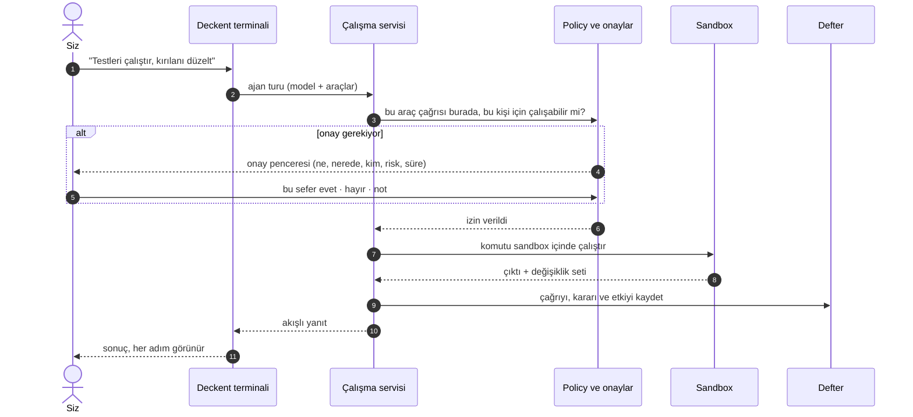
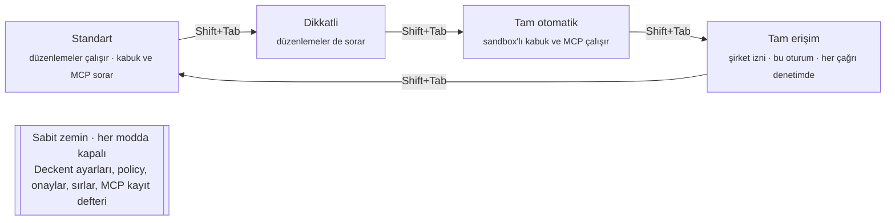
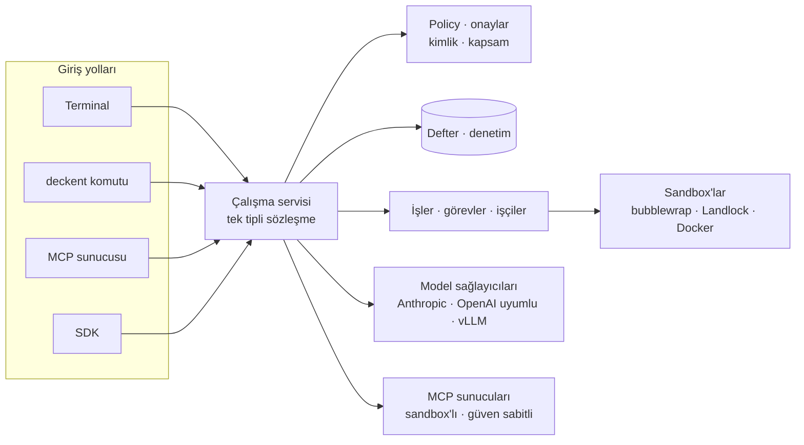
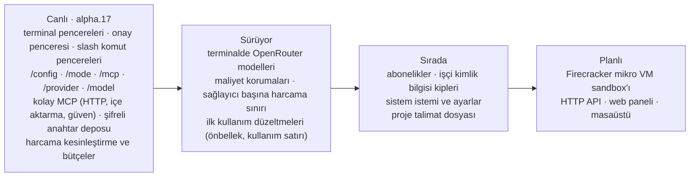

<div align="center">

# Deckent

**Agent Control & Execution Plane**

İnsanların, yapay zekâ ajanlarının ve araçların her eylemi sizin altyapınızda yetkilendirilir, yalıtılır, çalıştırılır ve kanıtlanır.

*policy-driven agent runtime · governed execution · self-hosted agent control plane*

[](https://github.com/Verhex/deckent-next/actions/workflows/ci.yml)
[](LICENSE)
[](package.json)
[](CHANGELOG.md)

[English](README.md) · [Deckent nedir](#deckent-nedir) · [Bir istek nasıl akar](#bir-istek-nasıl-akar) · [Terminalde](#terminalde) · [Güvenlik](#güvenlik-modeli) · [Başlarken](#başlarken)


</div>

<!-- Node ve pre-release rozetleri bu yerel dalı değil, public main package.json'u okur.
Her sürümde package.json sürümü ile CHANGELOG.md satırını birlikte güncelleyin.
npm rozetleri: ilk npm yayınından ve paket kimliği doğrulandıktan sonra açılır. Kapsamsız `deckent` adı kullanılamıyor
(mevcut bir paketle çakışıyor); planlanan ad kapsamlı `@verhex/deckent` (owner 2026-10-07, kesin değil).
[](https://www.npmjs.com/package/@verhex/deckent)
[](https://www.npmjs.com/package/@verhex/deckent)
-->

> [!NOTE]
> **Ön sürüm `1.0.0-alpha.17`**, 2026-10-08'den beri canlı. Deckent henüz npm'de yok; [Başlarken](#başlarken)
> bölümündeki gibi kaynaktan kurun. Her sürümün içeriği [CHANGELOG.md](CHANGELOG.md) içinde.

## Deckent nedir

Yapay zekâ ajanları artık kendi başına kod yazıyor, komut çalıştırıyor ve araç çağırıyor. Zor soru artık *ajan bunu
yapabilir mi* değil; *yapmalı mı, nerede, kimin yetkisiyle ve ne olduğunu nasıl bileceğiz*. Çoğu ürün bu sorunun
yalnız yarısını cevaplar: kimisi ajanları çalıştırır, kimisi başka yerde çalışan ajanları yönetir.

Deckent iki yarıyı tek üründe, sizin makinelerinize kurulu olarak birleştirir. Bir havalimanı düşünün: **kule** kimin
kalkacağına karar verir ve her uçuşu kaydeder, **pist** ise uçuşun gerçekten yapıldığı yerdir. Deckent kule ile
pisttir. Bir insanın ya da ajanın neyi yapabileceğine karar verir, o işi yalıtılmış bir ortamda çalıştırır ve sonradan
kontrol edebileceğiniz kalıcı bir kayıt tutar.

Deckent'le terminali, `deckent` komutu, MCP sunucusu ya da SDK üzerinden konuşursunuz. Hepsi aynı tipli sözleşmeyi
kullanır; bir insanın tıklaması ile bir ajanın araç çağrısı aynı kimlik, policy ve onay kontrollerinden geçer. Açık
kaynak Core (Apache-2.0) tek başına çalışır; proprietary Enterprise sürümü Core'u değiştirmeden üstüne eklenir.

| | |
|---|---|
| 🗼 **Yönetir** | İnsanlar ve yapay zekâ ajanları için tek kimlik, kapsam ve policy modeli. Bir iş onay isterse pencere neyin onaylandığını tam gösterir: tam komut, nerede çalışacağı, kimin adına, risk, geri alınıp alınamayacağı ve süre. Persona ya da model tavsiyesi asla yetki vermez. |
| 🛫 **Yürütür** | İşler (Run), görevler ve işçiler sizin makinelerinizde kabul edilir, sıralanır ve kurtarılır. Ajanın kabuk komutları ve MCP sunucuları sandbox içinde (bubblewrap, Landlock), işçiler Docker'da çalışır. Anthropic, OpenAI, DeepSeek, Z.ai (GLM), OpenAI uyumlu uç noktalar, OpenRouter (şimdilik yalnız anahtar) ve yerel vLLM modelleriyle; Claude Code, Codex ve Cursor işçileriyle çalışır. |
| 📜 **Kanıtlar** | Her karar ve etki kalıcı bir defter ve denetim izine yazılır. Onaylar mühürlenir, yamalar saklanır ve değişiklikler teslimden önce yalıtılmış bir adayda birleştirilir. |

## Bir istek nasıl akar

İsteğinizi düz bir cümleyle söylersiniz. Deckent bunu kontrol edilmiş, yalıtılmış adımlara çevirir; policy ve izin
modunuz izin vermedikçe hiçbir şey çalışmaz.



## Terminalde

Bu ekranlar gerçek Deckent terminalinden (alpha.10, 110×32; sonradan eklenen `/provider`, `/model` ve slash komut pencereleri henüz görselde yok), yerel bir deneme modeliyle geçici bir örnek projede
çekildi.

<table>
  <tr>
    <td width="50%"><br><sub><b>Sohbet.</b> Sizin satırlarınız ve Deckent'in yanıtları belirgin biçimde ayrışır.</sub></td>
    <td width="50%"><br><sub><b>Onay penceresi.</b> Ne, nerede (sandbox), kimin adına, kapsam, neden, risk, geri alınabilirlik ve canlı süre. <code>y</code> bu sefer · <code>n</code> reddet · <kbd>Tab</kbd> not.</sub></td>
  </tr>
  <tr>
    <td width="50%"><br><sub><b>/status.</b> Önce insan dilinde özet; kimlikler, süreç ve build ayrıntıda.</sub></td>
    <td width="50%"><br><sub><b>Modlar.</b> <kbd>Shift</kbd>+<kbd>Tab</kbd> yetkili olduğunuz modlar arasında döner; tam erişim açıkça işaretlenir.</sub></td>
  </tr>
  <tr>
    <td width="50%"><br><sub><b>/help.</b> Komutlar amaca göre gruplu, her biri tek satır.</sub></td>
    <td width="50%"><br><sub><b>/mcp.</b> Yapılandırılmış MCP sunucuları, güven ve sağlık durumları.</sub></td>
  </tr>
</table>

## Güvenlik modeli

Ajanın yaptığı her araç çağrısına iki şey birlikte karar verir: kurumunuzun policy'si ve seçtiğiniz izin modu.
Yetkili olduğunuz modlar arasında <kbd>Shift</kbd>+<kbd>Tab</kbd> ya da `/mode` ile geçersiniz.



| Mod | Sormadan çalışır | Önce sorar |
|---|---|---|
| **Standart** | Okumalar, sıradan dosya düzenlemeleri | Kabuk komutları, korunan yollar, MCP çağrıları |
| **Dikkatli** | Okumalar | Her düzenleme de |
| **Tam otomatik** | Düzenlemeler, sandbox içinde kalan kabuk komutları, MCP çağrıları | Yıkıcı komutlar (`rm -r`, …), korunan yollar |
| **Tam erişim** | Şirket policy'sinin sabit zeminin üstünde izin verdiği her şey; her etkili çağrı denetime yazılır | Sabit zemin ve şirket policy'sinin hâlâ istediği onaylar (deny her zaman kazanır); şirket izni gerekir ve oturum boyunca geçerlidir |

Standart, dikkatli ve tam otomatik modlarda sandbox'taki kabuk komutu **kapalı bir görünüm** alır: proje yazılabilir,
`.git` salt okunur, ağ yoktur ve ev klasörünüz gizlidir. **Tam erişim bu görünümü bilerek açar**: host dosya sistemi,
gerçek ev klasörünüz (sırlar maskeli), ağ ve `.git` yazımı kullanılabilir olur; yalnız sabit zemin maskeli kalır. Bir
makinede sandbox kullanılamıyorsa `prefer-sandbox` ortamı host'ta çalışır ve bunu her onay kartında söyler,
`require-sandbox` ortamı ise çalışmayı reddeder.

### API anahtarları

Sağlayıcı anahtarını bir kez `deckent secret set AD` ile kaydedersiniz (gizli istem ya da stdin; asla komut argümanı değil);
model profili ona adıyla başvurur. Anahtarı `ANTHROPIC_API_KEY`, shell profili ya da `.env` dosyasına koymayın: başka araçlar
oraları okur.

| Depo (`secrets.store`) | Diskte | Anahtarı kim okuyabilir |
|---|---|---|
| `core.secret-store.env@1` (varsayılan) | hiçbir şey; ortam değişkeninden okunur | o ortamı devralan her program |
| `core.secret-store.file@1` | düz metin, 0600 dosya | Deckent ve sizin hesabınızla çalışan diğer programlar |
| `core.secret-store.encrypted-file@1` (önerilen) | şifreli (AES-256-GCM); açma anahtarı aynı klasörde, parola yok | Deckent; sizin hesabınızla çalışan diğer programlar yine açabilir |

Ajanlar ve worker'lar anahtarı hiç almaz: sandbox depoyu gizler, anahtarı geri yansıtan sağlayıcı yanıtı reddedilir.
`deckent doctor` hangi deponun etkin olduğunu ve kimin okuyabileceğini gösterir. Sağlayıcı anahtarı reddederse (401/403) ya da
bir limit dolarsa terminal bunu açık sözlerle söyler; harcama limitleri sağlayıcı hesabınızda kalır.

**Katı kurulum**, anahtarı makinedeki başka hiçbir programın okumaması gerekiyorsa:

1. Anahtarlarınızı şifreli depoya taşıyın: `deckent secret store` kayıtlı depoları seçmeniz için listeler; her anahtarı kopyalar,
   doğrular, yeni depoyu seçer ve ardından eski kopyayı siler (daha zayıf bir depoya geçiş önce sorar). Linux, WSL ve macOS'ta
   `deckent init policy` ile kurulanlar zaten şifreli depoyla başlar.
2. Diğer yapay zekâ araçlarını Deckent'in durum klasöründen uzak tutun; örneğin Claude Code'un `~/.claude/settings.json`
   dosyasında depo dosyaları için `Read` yasak kuralları. Bu, dosya araçlarını ve yaygın shell komutlarını durdurur, her betiği değil.
3. Planlanan: Deckent servisini ayrı bir işletim sistemi kullanıcısında (ya da macOS Keychain ile) çalıştırmak; böylece hesabınızdaki hiçbir program anahtarları okuyamaz.

Dosya depoları native Windows'ta henüz yok.

## Mimari

Her giriş yolu aynı tipli sözleşmeyi konuşur. Çalışma servisine bağlı işlemler tek bir çalışma servisinden geçer;
servis her işlemde kimliği, kapsamı ve policy'yi kontrol eder, sonucu deftere yazar ve etkilerin yalnız policy'nin
izin verdiği yerde olmasına izin verir. Kurulum, gözlem ve bazı yama işlemleri aynı sözleşmeyi servis olmadan yerelde
kullanır.



## Bugün neler yapabilirsiniz

- **Terminalde ajanla çalışın**: akışlı turlar, dosya düzenleme ve sandbox'lı kabuk, onay ve izleme pencereleri,
  izin modları, MCP araçları, konuşma sıkıştırma, Türkçe ve İngilizce.
- **İşleri yönetin**: Run, Task ve Attempt kabul edin, bağımlılıkları sıralayın, kapasite ayırın, iptal edin ve
  kurtarın; hepsi kalıcı bir SQLite defterine yazılır.
- **Kodlama işçileri kullanın**: Git tabanlı çalışma kopyaları ve Claude Code, Codex, Cursor ile Docker işçileri;
  yamalar saklanır, yalıtılmış bir adayda birleştirilir, sonra teslim edilir ya da yayınlanır.
- **Yönetişim**: yerel kimlik, şirket kapsamlı policy, denetim ve her yüzey için tek onay aracısı; doğrulanmamış
  kanıt için insan kabulü ya da reddi.
- **Model seçin**: istemci ve faturalama kanalına göre model kataloğu, birebir etkinleştirme, yerel vLLM sohbeti;
  `/provider` ve `/model` kendi anahtarınızla sağlayıcı bağlar ve oturum için modeli sabitler; ücretli çağrılar,
  sağlayıcının kullanım verisi ile doğrulanmış yayımlanmış tarifenin çarpımından, belirlediğiniz bütçe altında
  kesinleşir (fiyatı bilinmeyen uzak model reddedilir ve nedeniyle kilitlenir); harcama ve ayırma denetimi.
- **İşletin**: tüm kurulumlar için salt okunur `deckent monitor`, sağlık için `deckent doctor`, ayarlar için
  `deckent config`, her yerde iki dilli yardım.

Henüz yok: otonom iş süreci koordinasyonu (Mission/`do`), Enterprise SSO ve filo yönetimi, uzak HTTP API, masaüstü ve
web paneli. Docker işçisi host çekirdeğini paylaşır; sanal makine değildir.

## Yol haritası



## Başlarken

Deckent, Linux ya da Windows WSL2 üzerinde Node.js ≥ 24.15.0 ile çalışır (Node 24 ve 26 desteklenir); kodlama
işçileri için Docker gerekir. npm paketi yayımlanana kadar bir kez kaynaktan derleyin:

```sh
git clone https://github.com/Verhex/deckent-next.git && cd deckent-next
npm ci && npm run build && npm link
```

Bundan sonra her şey `deckent` ile yapılır:

```sh
deckent --version
deckent                                   # etkileşimli terminali aç
deckent doctor                            # kurulum sağlığı
deckent init preview --profile <dosya>    # bir proje için kurulumu önizle
deckent mcp add context7 -- npx -y @upstash/context7-mcp   # MCP sunucusu ekle
deckent monitor                           # kurulumları ve işleri izle
deckent --help                            # tüm komutlar; ayrıntı için deckent <komut> --help
```

## Daha fazlası

- [ARCHITECTURE.md](ARCHITECTURE.md): sözleşmeler, katmanlar ve değişmezler
- [İşletim başvurusu](.deckent/docs/architecture/operator-reference.tr.md): işçi araç sürümleri, işçi imajları, kodlama
  profilleri, yama muhafazası ve kurulum muhafaza kuralları
- [CHANGELOG.md](CHANGELOG.md): her sürümün getirdikleri
- [CONTRIBUTING.md](CONTRIBUTING.md) · [Davranış kuralları](CODE_OF_CONDUCT.md) · [Güvenlik](SECURITY.md)

## Lisans

Apache-2.0 (bkz. [LICENSE](LICENSE)).
