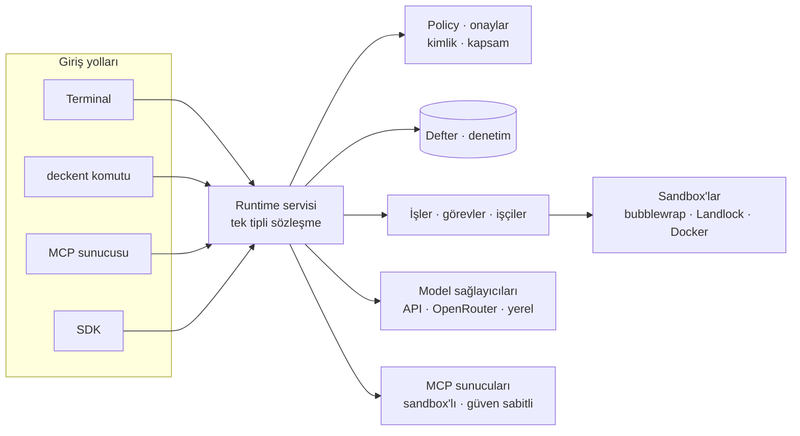
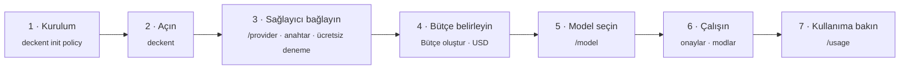
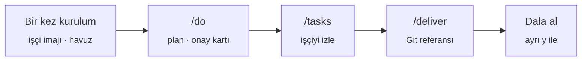
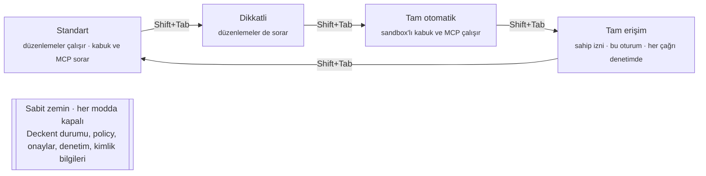
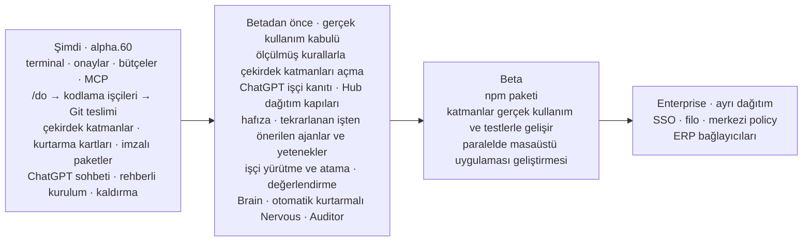

<div align="center">

# Deckent

**Agent Control & Execution Plane**

Deckent, insanların ve yapay zekâ ajanlarının isteklerini kendi makinelerinizde yetkili, yalıtılmış ve kayıtlı işlere dönüştürür.

*policy-driven agent runtime · governed execution · self-hosted agent control plane*

[](https://github.com/Verhex/deckent-next/actions/workflows/ci.yml)
[](LICENSE)
[](package.json)
[](CHANGELOG.md)

[English](README.md) · [Deckent nedir](#deckent-nedir) · [Nasıl çalışır](#nasıl-çalışır) · [Başlarken](#başlarken) · [İlk iş](#adım-adım-ilk-işiniz) · [Gündelik kullanım](#gündelik-kullanım) · [Güvenlik](#güvenlik-ve-denetim) · [Bugün](#bugün-neler-çalışıyor) · [Yol haritası](#yol-haritası)


</div>

<!-- Node ve pre-release rozetleri bu yerel dalı değil, public main package.json'u okur.
Her sürümde package.json sürümü ile CHANGELOG.md satırını birlikte güncelleyin.
npm rozetleri: ilk npm yayınından ve paket kimliği doğrulandıktan sonra açılır. Kapsamsız `deckent` adı kullanılamıyor
(mevcut bir paketle çakışıyor); planlanan ad kapsamlı `@verhex/deckent` (önerilen ad; kesinleşmedi).
[](https://www.npmjs.com/package/@verhex/deckent)
[](https://www.npmjs.com/package/@verhex/deckent)
-->

> [!NOTE]
> Bu README geçerli sürüm adayını anlatır: **ön sürüm `1.0.0-alpha.60`**. [CHANGELOG.md](CHANGELOG.md) tüm
> sürümleri en yenisi başta listeler. Deckent henüz npm'de yok: [Başlarken](#başlarken) bölümündeki gibi kaynaktan kurun. npm paketi beta için,
> büyük olasılıkla `@verhex/deckent` adıyla planlanıyor (ad henüz kesin değil).

## Deckent nedir

Yapay zekâ ajanları artık komut çalıştırabiliyor, kod değiştirebiliyor ve iş sistemlerini çağırabiliyor. Artık asıl
zorluk onları çalıştırmak değil; zor olan, bir işe kimin izin verdiğini, nerede çalıştığını, kaça mal olduğunu ve nasıl geri
alınacağını bilmektir. Çoğu araç bunu ekranın başındaki kişiye bırakır.

Deckent bu soruları yanıtlayan katmandır. Onu kendi makinelerinize kurarsınız; her istek, ister terminaldeki bir kişiden ister
MCP üzerinden bir yapay zekâ ajanından ya da bir betikten gelsin, aynı kontrollerden geçer: kimlik, kapsam, policy, onay ve
bütçe. İş sonra bir sandbox'ta ya da Docker işçisinde çalışır; her karar ve etki kalıcı bir deftere (ledger) yazılır.
Örneğin Deckent ücretli bir model çağrısından önce çağrının tutabileceği en yüksek tutarı projenin bütçesinden ayırır; fiyat
bilinmiyorsa ya da bütçe yetmiyorsa çağrı, hiçbir şey gönderilmeden reddedilir.

Aynı temel, dizüstü bilgisayarında çalışan tek bir kişiye de çok ekipli bir şirkete de hizmet edecek biçimde kuruldu. İlk kullanım yazılım
işidir: kodlama işçileri (Claude Code, Codex ve Cursor) görevi Docker içinde yapar, Deckent değişikliği Git'e teslim eder.
ERP veya CRM gibi iş sistemleri de aynı sözleşmeyi kullanır: tanımlı bir operasyon, yalnız kayıt değişmemişse uygulanan
bir yazma, asla iki kez uygulanamayan bir yeniden gönderme, kanıta dayalı kabul ve bir şeyin geri alınması gerektiğinde
planlı bir geri alma (telafi). Core bu sözleşmeyi ve genel bir HTTP hedefini içerir;
belirli ERP ürünleri için bağlayıcılar henüz yapılmadı.

Açık kaynak Core (Apache-2.0) tek başına çalışır. Kapalı kaynak (ticari) Enterprise sürümü, Core'u değiştirmeden
Core'un eklenti kayıt defterine (registry) takılan ayrı bir dağıtım olarak planlanıyor; Enterprise SSO, filo yönetimi ve ERP
bağlayıcıları orada yer alır. Aşağıda geçen kapsam (scope), Run ve onay gibi terimleri [sözlük](docs/glossary.tr.md) açıklar.

## Nasıl çalışır

İsteğinizi düz bir cümleyle söylersiniz. Deckent bunu kontrol edilmiş, yalıtılmış adımlara çevirir; policy ve izin modunuz
izin vermedikçe hiçbir şey çalışmaz.


```mermaid
sequenceDiagram
  autonumber
  actor Siz
  participant T as Deckent terminali
  participant R as Runtime servisi
  participant P as Policy ve onaylar
  participant B as Sandbox
  participant L as Defter
  Siz->>T: "Testleri çalıştır, kırılanı düzelt"
  T->>R: ajan turu (model + araçlar)
  R->>P: bu araç çağrısı burada, bu kişi için çalışabilir mi?
  alt onay gerekiyor
    P-->>Siz: onay penceresi (ne, nerede, kim, risk, süre)
    Siz->>P: bu sefer evet · hayır
  end
  P-->>R: izin verildi
  R->>B: komutu sandbox içinde çalıştır
  B-->>R: çıktı + değişiklik seti
  R->>L: çağrıyı, kararı ve etkiyi kaydet
  R-->>T: akışlı yanıt
  T-->>Siz: sonuç, her adım görünür
```

Bunu üç iş birlikte sağlar:

| | |
|---|---|
| 🗼 **Yönetir** | İnsanlar ve yapay zekâ ajanları için tek kimlik, kapsam ve policy modeli. Bir iş onay isterse pencere neyin onaylandığını tam gösterir: tam komut, nerede çalışacağı, kimin adına, risk, geri alınıp alınamayacağı ve süre. Bir rol tanımı (persona) ya da model tavsiyesi asla izin vermez. |
| 🛫 **Yürütür** | İşler (Run), görevler ve işçiler sizin makinelerinizde başlatılır, sıralanır ve kurtarılır. Ajanın kabuk komutları ve MCP sunucuları, makine sağlıyorsa sandbox içinde (bubblewrap, Landlock), kodlama işçileri Docker'da çalışır. Modeller Anthropic, OpenAI, DeepSeek, Z.ai ve Zhipu (GLM), OpenRouter, yerel bir sunucu ya da fiyatı yayımlanmış OpenAI uyumlu bir uç noktadan gelir. |
| 📜 **Kanıtlar** | Her karar ve etki kalıcı bir defter ve denetim izine yazılır. Onaylar mühürlenir, yamalar saklanır ve değişiklik teslimden önce deponuzun ayrı bir kopyasında denenir. |

Her giriş yolu aynı tipli sözleşmeyi kullanır: tek bir operasyon ve kontrol takımı. Runtime gerektiren işlemler proje başına tek bir yerel runtime servisinden
geçer; servis her çağrıda kimliği, kapsamı ve policy'yi kontrol eder, sonucu deftere yazar ve etkilerin yalnız policy'nin
izin verdiği yerde olmasına izin verir. Kurulum, gözlem ve bazı yama adımları aynı sözleşmeyi servis olmadan yerelde kullanır.


```mermaid
flowchart LR
  subgraph Giriş yolları
    T[Terminal]
    C["deckent komutu"]
    M[MCP sunucusu]
    S[SDK]
  end
  T & C & M & S --> R["Runtime servisi<br/>tek tipli sözleşme"]
  R --> P["Policy · onaylar<br/>kimlik · kapsam"]
  R --> L[("Defter · denetim")]
  R --> X["İşler · görevler · işçiler"]
  X --> B["Sandbox'lar<br/>bubblewrap · Landlock · Docker"]
  R --> G["Model sağlayıcıları<br/>API · OpenRouter · yerel"]
  R --> N["MCP sunucuları<br/>sandbox'lı · güven sabitli"]
```

## Başlarken

Sizin adınıza kurulum yapan AI asistanı için [AI kurulum rehberini](docs/ai-install.tr.md) kullanın; yalnız sizin tamamlayabileceğiniz adımları belirtir.

### Gereksinimler

- x86_64 üzerinde Linux ya da WSL2 ile Windows. Native Windows desteklenmiyor; macOS'ta runtime servisi henüz çalışmıyor
  (bkz. [Henüz olmayanlar](#henüz-olmayanlar)).
- Node.js: 24.x hattında 24.22.1 veya üstü ya da 26.12.1 veya üstü (Node 25 desteklenmez).
- Docker. Kaynaktan derleme onu kilitli bubblewrap sandbox'ını (0.13.0) derlemek için kullanır; kodlama işçileri de onun
  içinde çalışır. Derlemeden sonra Ollama ya da LM Studio gibi yerel bir model sunucusu kullanırsanız ilk sohbet ne Docker
  ne de ücretli bir çağrı ister.
- Git ve C derleme araçları (native yalıtım yardımcısı için).

### Kaynaktan kurulum

npm paketi yayımlanana kadar Deckent'i bir kez kaynaktan derleyin ve `deckent` komutunu bağlayın:

```sh
git clone https://github.com/Verhex/deckent-next.git
cd deckent-next
npm ci
node scripts/build-bwrap.mjs --arch all --out .pack/bwrap/first-build
node scripts/build-bwrap.mjs --stage-dev .pack/bwrap/first-build
npm run build
npm link
```

Build `bubblewrap=present` ya da `bubblewrap=staged from …` ile biter. `BUBBLEWRAP_BUILD_REQUIRED` ile durursa Docker'a
ulaşılamamıştır: Docker'ı başlatın, iki `build-bwrap` komutunu yeni bir `--out` dizinle (örneğin
`.pack/bwrap/second-build`) yeniden çalıştırın, sonra `npm run build`. Ubuntu 24.04 ve sonrasında çekirdek, bubblewrap'ın ihtiyaç
duyduğu kullanıcı ad alanlarını engelleyebilir; Deckent bunu söyler ve Landlock'a düşer. İki durumu ve bir yöneticinin
kısıtı nasıl kaldıracağını
[işletim başvurusu](.deckent/docs/architecture/operator-reference.tr.md#kaynak-derleme-ve-sandbox-durumu) anlatır. Ön
koşulları ve sağlayıcı anahtarı gerektirmeyen tek bir testi [katkıcı hızlı başlangıcı (EN)](CONTRIBUTING.md#a-30-minute-quickstart)
gösterir.

### Adım adım ilk oturum

Bu adımlar sizi boş bir projeden yönetilen bir sohbete ve onun maliyetine, Deckent'ten çıkmadan götürür. Deckent kaynak dizininin dışındaki
kendi proje klasörünüze geçin; bundan sonra her şey `deckent` ile yapılır.


```mermaid
flowchart LR
  I["1 · Kurulum<br/><sub>deckent init policy</sub>"] --> O["2 · Açın<br/><sub>deckent</sub>"]
  O --> P["3 · Sağlayıcı bağlayın<br/><sub>/provider · anahtar · ücretsiz deneme</sub>"]
  P --> B["4 · Bütçe belirleyin<br/><sub>Bütçe oluştur · USD</sub>"]
  B --> M["5 · Model seçin<br/><sub>/model</sub>"]
  M --> W["6 · Çalışın<br/><sub>onaylar · modlar</sub>"]
  W --> U["7 · Kullanıma bakın<br/><sub>/usage</sub>"]
```

1. **Proje başına bir kez kurun.** *Kapsam (scope)*, policy'yi, iş kayıtlarını ve harcamayı bu projeye bağlayan sabit addır;
   bir klasör ya da sandbox değildir. `my-project` gibi bir ad seçin, ilk kurulum policy'sini önizleyin ve kurun:

   ```sh
   deckent init policy --scope my-project --preview
   deckent init policy --scope my-project --apply
   deckent doctor
   ```

   Bu policy o kapsamda model bağlamanıza ve çağırmanıza, anahtar saklamanıza ve bütçe belirlemenize izin verir; bu
   eylemlerin her biri yine kontrol edilir ve kaydedilir. `deckent doctor` neyin hazır olduğunu söyler, kurulum
   başlayamıyorsa sıfır dışı kodla çıkar. `deckent init` aynı kurulumu adım adım yapar ve eksik kalanı listeler.
2. **Terminali açın**: `deckent`. Az önce kurduğunuz kapsamda açılır (`deckent --scope my-project` kapsamı açıkça seçer) ve
   runtime servisini arka planda başlatır.
3. **Sağlayıcı bağlayın**: `/provider`. Anahtarı gizlenen bir alana yazarsınız; sağlayıcı sunuyorsa Deckent onu ücretsiz
   bir istekle dener ve adıyla saklar. Değer bir daha gösterilmez ve hiçbir ajan ya da işçi onu almaz. Ardından **Model
   bağla**'yı seçip sağlayıcının listesinden birebir bir model seçin. Bağlamak, modeli bu kapsamda çağrılabilir yapar;
   5. adım bu oturumun bağlı modellerden hangisini kullanacağını seçer.
4. **Bütçe belirleyin.** Her ücretli API turu kapsamın tek ve ortak USD bütçesinden pay ayırır; bütçe yoksa her ücretli tur
   reddedilir ve pencereler nedenini söyler. `/provider`'ın ilk satırı **Bütçe oluştur**, 5 ile 100 USD arası hazır tutarlar
   ya da 1000'e kadar başka bir tam dolar tutarı sunar, ardından bir onay adımı gelir. Yerel modeller bütçe istemez.
5. **Model seçin**: `/model` ile, yalnız bu oturum için ya da varsayılanınız olarak. Henüz kullanamayacağınız model, nedeni
   ve çözümüyle kilitli görünür.
6. **Çalışın.** İsteğinizi düz bir cümleyle söyleyin. Araç çağrıları kurulumunuzun policy'sine ve izin modunuza uyar; size
   danışılması gereken her şey onay penceresini açar (bkz. [Güvenlik ve denetim](#güvenlik-ve-denetim)).
7. **Kullanıma bakın**: `/usage` bu konuşmanın kullandığı token'ları ve kapsamın bütçelerini gösterir. Bu, Deckent'in
   ölçümüdür; sağlayıcının faturası değildir.

Bu ekranlar gerçek terminalden, alpha.53'te (120×36, varsayılan tam pencere düzeni) geçici bir projede ve küçük bir yerel
deneme modeliyle çekildi: hiçbir sağlayıcı çağrılmadı ve gerçek bir anahtar kullanılmadı. Her pencerenin üstündeki boş
konuşma satırları kırpıldı; başka hiçbir şey değiştirilmedi.

<table>
  <tr>
    <td width="50%"><br><sub><b>Bütçeden önce.</b> <code>/model</code> önce <b>Bütçe oluştur</b> satırını sunar. Yerel deneme modeli zaten kullanılabilir, çünkü yerel modeller bütçe istemez; bu kapsamın çağıramayacağı model nedeniyle kilitlidir.</sub></td>
    <td width="50%"><br><sub><b>/provider.</b> Önce <b>Bütçe oluştur</b>, sonra her sağlayıcı bağlantı durumuyla.</sub></td>
  </tr>
  <tr>
    <td width="50%"><br><sub><b>Bütçe penceresi.</b> Hazır tutarlar ya da ok tuşlarıyla başka bir tutar.</sub></td>
    <td width="50%"><br><sub><b>Başka tutar.</b> Tam dolar, 1 ile 1000 arası; onaylamadan hiçbir şey gönderilmez.</sub></td>
  </tr>
  <tr>
    <td width="50%"><br><sub><b>Bütçeden sonra.</b> Çerçeveli sistem satırı bütçeyi kaydeder; ilk satır artık <b>Bütçeyi değiştir</b> der.</sub></td>
    <td width="50%"><br><sub><b>/usage.</b> Bu konuşmanın ölçtüğü token'lar ve kapsamın bütçeleri.</sub></td>
  </tr>
</table>

3. ve 4. adımlar komut satırından da yapılır; betikler ve yapay zekâ araçları bu yolu kullanır:

```sh
deckent secret set DECKENT_ANTHROPIC_KEY --main
deckent models create-budget --scope my-project --usd 20
deckent models connect --scope my-project --connection anthropic-api --command-id connect-1 --model claude-sonnet-5-5
```

`secret set` anahtarı gizli bir istemde sorar, borudan (pipe) gelen anahtarı reddeder. `--command-id` sizin seçtiğiniz
benzersiz bir addır; aynı komutu onunla yinelemek asla iki kez bağlamaz. Her sağlayıcının gizli adını, yerel ve
OpenAI uyumlu seçenekleri ve bugün abonelikle neyin çalıştığını
[işletim başvurusu](.deckent/docs/architecture/operator-reference.tr.md#sağlayıcı-bağlantı-ayrıntıları) listeler.

## Adım adım ilk işiniz

Sohbet yalnız başlangıçtır. Bir işte Deckent çalışmayı planlar, planı siz onaylarsınız, bir kodlama işçisi işi Docker içinde
yapar ve değişiklik bir Git referansına teslim edilir. Siz seçmedikçe hiçbir şey dallarınızdan birine ulaşmaz.


```mermaid
flowchart LR
  S["Bir kez kurulum<br/><sub>işçi imajı · havuz</sub>"] --> D["/do<br/><sub>plan · onay kartı</sub>"]
  D --> T["/tasks<br/><sub>işçiyi izle</sub>"]
  T --> L["/deliver<br/><sub>Git referansı</sub>"]
  L --> B["Dala al<br/><sub>ayrı y ile</sub>"]
```

Başlamadan önce: Docker çalışıyor; proje en az bir commit'i olan bir Git deposu; bütçeli bir model bağlı (bkz.
[Adım adım ilk oturum](#adım-adım-ilk-oturum)); işçi olarak istediğiniz kodlama CLI'ı bu makinede kurulu ve girişli
(`codex login`; Claude Code için `claude` yazıp `/login`). İşçi, kendi konteynerinde o CLI'ın kendi girişini kullanır;
sağlayıcı API anahtarlarınız işçilere asla verilmez. Temiz bir makinede model bağlamaya kadar her şeyi prova ettik;
aşağıdaki iş adımları Deckent'in kendi geliştirmesinde her gün kullanılıyor ama henüz sıfırdan prova edilmedi
([bilinen sınırlar](docs/known-limits.tr.md)).

### Bir kez yapılan kurulum

İş bir işçi konteynerinde çalışır; bu yüzden Deckent'in bir işçi imajına, işin nerede çalışacağını söyleyen ayarlara, ilk
iş türüne ve bir işçi havuzuna ihtiyacı var. `deckent init` kurar; `deckent`i ilk açtığınızda kurulum adımları (`/setup`)
dördünü de kendi terminalinizde hazırlar. Her adım bir kartla sorar ve siz onaylamadan hiçbir şey yazmaz.

```sh
# 1. Projenizde: kurun, sonra terminali açıp kurulum adımlarını izleyin (işçi imajını derleyin ya da seçin, yürütme
#    ayarları, ilk iş türü, işçi havuzu). /setup bunları sonra yeniden açar.
deckent init
deckent
#    Terminal olmadan doctor eksik her adımı tam komutuyla yazar (aşağıya bakın):
deckent doctor

# 2. Servis zaten çalışıyorduysa yeni ayarları okusun diye yeniden başlatın
deckent runtime restart
```

İmaj derlemesi Docker ve ağ kullanır (temel imaj ve kodlama CLI'ları); kartı, bir şey başlamadan önce boyutu ve süre
sınırını söyler. Yürütme ayarları kurulum adımının bulduğu Docker ve Git'i ve imajı yazar; diğer değerler
varsayılanında kalır (`deckent config explain execution`). İlk iş türü, seçtiğiniz kodlama CLI'ı üzerinde `coding`'dir
(`codex`, `claude` ya da `cursor`; Cursor işçisi bir katalog adımı daha ister, işletim başvurusuna bakın); havuzu
`workers`, bir çalışma yuvasıyla. Başka bir iş türü, havuz adı ya da kapasite için veya terminal olmadan,
`deckent doctor` eksik adımları tam komutlarıyla yazar, örneğin:

```sh
deckent init registry --scope my-project --provider codex --kind coding --pool my-workers \
  --execution-slots 2 --in-flight-slots 2 --discovery repository --preview
deckent init pool --scope my-project --preview
```

Her `--preview` neyin değişeceğini gösterir ve hiçbir şey yazmaz; yazmak için aynı komutu `--apply` ile çalıştırın.
`--discovery repository` işçi CLI'ının deponuzun kendi talimat dosyalarını, hook'larını ve MCP ayarlarını yüklemesine
izin verir; bunları gizlemek için bayrağı vermeyin (varsayılan). Her değeri, her
önizlemenin neyi kontrol ettiğini ve güncel ilk kurulum policy'sinden önce kurulmuş bir kurulumda ne yapılacağını
[işletim başvurusu](.deckent/docs/architecture/operator-reference.tr.md#adım-adım-ilk-iş-kurulumu) anlatır.

### İşi çalıştırın

1. **İsteyin.** Terminalde `/do` yazıp isteğinizi sade sözlerle yazın (komut satırında `deckent do --request "<metin>"`).
   Bağlı bir model planlar; Deckent planı her görev için bir kabul satırıyla basar:

   ```text
   Run <run-id> için plan · <durum>
   Görev t1: <görevin yaptığı iş> · tür coding · iş sınıfı <sınıf>
     Kabul: <sonucun karşılaması gereken ölçüt>
   Başlatılırken policy'nin denetlediği izinler: <her görev için bir task/execute>
   TTY onayınız bekleniyor: <onay-kimliği>, son tarih <saat>. Model bu işe yetki veremez.
   ```

   *İş sınıfı* (WorkClass), görevin gerektirdiği emeğin türüdür; işçiyi ve modeli o seçer.

2. **Onaylayın.** Bir kart Run'ı oluşturmayı onaylamanızı ister. Planı ve kabul satırlarını değerlendirin (kartın risk ve
   geri alma satırları planlar için henüz sınıflandırılmıyor), sonra `y`'ye basın. Kart 10 dakika sonra sona erer; model
   sizin yerinize onaylayamaz. Ardından gelen `Run <run-id> başlatıldı. /tasks veya /monitor ile izleyin.` satırı işin
   başladığını söyler; sonucun kabul edildiğini değil.
3. **İzleyin**: `/tasks` ya da `/monitor` ile (terminal dışında `deckent monitor`). İşçi başarıyla bitince (bugün bu,
   çıkış kodu 0 demektir; içerik henüz bağımsız doğrulanmıyor) görev teslimi bekler.
4. **Teslim edin**: `/deliver`. Pencere önce işi sade sözlerle özetler: başlığı, neyin değiştiği, neden kabul edildiği
   (işçinin kendi raporu iddia olarak işaretlenir), risk ve evet ya da hayırın ne yapacağı. Ardından değişen dosyaları
   listeler. `y` değişikliği yalnız `refs/deckent/deliveries/` altındaki ayrı bir referansa yazar; hiçbir dala, index'e ya da
   çalışma dosyalarınıza dokunmaz.
5. **Dalı ilerletin**, isterseniz ayrı bir `y` ile. Deckent yalnız izin verdiğiniz ve kimsenin checkout etmediği bir dalı
   ilerletir; bu yüzden önce bir dal açın:

   ```sh
   git branch deckent/first-job HEAD
   deckent config set execution.adoption.targets '["refs/heads/deckent/first-job"]'
   ```

   Sonuca `git log deckent/first-job` ile bakın ve birleştirmeyi kendiniz yapın. Proje teslim kuyruğunu (servisin dal başına
   teslim kuyruğu) kullanıyorsa dalı ilerletme kendi onayıyla geri alınabilir; komutları
   [işletim başvurusu](.deckent/docs/architecture/operator-reference.tr.md#teslim-kuyruğu-inceleme-ve-geri-alma) gösterir.


<sub><b>/tasks.</b> İşçiler ve Run'lar tek bir canlı pencerede; iptal onay ister (burada boş: henüz arka plan işi yok).</sub>

## Gündelik kullanım

### Terminalde

`deckent` etkileşimli terminali açar. Her slash komutu kendi penceresinde yanıt verir; <kbd>Esc</kbd> pencereyi kapatır ve
konuşmada metin yığını yerine tek bir çerçeveli `Deckent sistemi` satırı bırakır. Ayarlar yazarak değil seçerek değişir:
`/config` bölümden anahtara, oradan izin verilen değerlere ilerler; her değişiklik policy'den geçer ve bir onaya
dönüşebilir. `/help` tüm komutları amaca göre listeler; en çok kullanılanlar şunlardır:

| Amaç | Komutlar |
|---|---|
| İş | `/do` iş iste · `/tasks` canlı iş · `/runs` tüm Run'lar; durdur, sürdür, kapat · `/deliver` · `/cancel` |
| Onaylar | `/approvals` bekleyen bir onayı seç ve karar ver |
| Ayarlar | `/provider` · `/model` · `/config` · `/mode` · `/mcp` · `/policy` |
| Bilgi | `/status` · `/usage` · `/context` · `/doctor` · `/monitor` · `/scope` · `/help` |

<table>
  <tr>
    <td width="50%"><br><sub><b>Sohbet.</b> Sizin satırlarınız ve Deckent'in yanıtları belirgin biçimde ayrışır; her turda süre ve token.</sub></td>
    <td width="50%"><br><sub><b>Onay penceresi.</b> Ne, nerede, kimin adına, kapsam, neden, risk, geri alma ve canlı süre. Yanıtlar bir listedir; "bu oturum" ve "bu projede her zaman" yalnız policy sunduğunda görünür.</sub></td>
  </tr>
  <tr>
    <td width="50%"><br><sub><b>/status.</b> Önce insan dilinde özet; kimlikler, süreç ve build ayrıntıda.</sub></td>
    <td width="50%"><br><sub><b>Modlar.</b> <kbd>Shift</kbd>+<kbd>Tab</kbd> yetkili olduğunuz modlar arasında döner; tam erişim açıkça işaretlenir.</sub></td>
  </tr>
  <tr>
    <td width="50%"><br><sub><b>/help.</b> Komutlar amaca göre gruplu, her biri tek satır; pencere kaydırılır.</sub></td>
    <td width="50%"><br><sub><b>/mcp.</b> Adım adım sunucu ekleme; yapılandırılmış her sunucu güven durumunu ve nerede çalıştığını gösterir (burada ağ erişimli bir sandbox).</sub></td>
  </tr>
  <tr>
    <td width="50%"><br><sub><b>/provider.</b> OpenRouter dahil her sağlayıcı bağlantı durumuyla.</sub></td>
    <td width="50%"><br><sub><b>/config.</b> Bölüm, anahtar, sonra izin verilen değerlerden biri; geçerli olan işaretli.</sub></td>
  </tr>
  <tr>
    <td width="50%"><br><sub><b>Sistem satırları.</b> Kapanan her pencere tek bir çerçeveli özet satırı bırakır.</sub></td>
    <td width="50%"></td>
  </tr>
</table>

### Komut satırında

`deckent` komutu her çağrıda tek bir iş yapar ve insanlar için metin basar; aynı sonucu veri olarak almak için `--json`
ekleyin. Bir kişinin terminalinde, bir şeyi değiştiren komutlar eksik değerleri ok tuşlarıyla seçtirir ve bir kartla
onaylatır; yapay zekâ araçları, borular ve CI her değeri bayrakla verir ve onlara asla sorulmaz. `deckent --help` tüm
komutları, `deckent <komut> --help` ayrıntıyı gösterir.

```sh
deckent doctor                            # bu kurulumun sağlığı
deckent monitor                           # kurulumların ve işlerin canlı, salt okunur görünümü
deckent run list                          # bu kapsamın Run'ları, en yenisi önce
deckent approval list                     # önce bekleyen onaylar, kalan süreyle
deckent report --scope my-project --run <id>   # bir Run'ın maliyet ve kabul kanıtı
deckent audit verify                      # denetim geçmişini doğrula
deckent backup create --scope <kimlik> --set <klasör>   # doğrulanabilir bir kurtarma seti yaz (parola istemde)
deckent policy grants --mine              # kalıcı "her zaman" izinleriniz
deckent memory                            # kapsamın hafıza günlüğü: olgular ve dersler
deckent agents                            # kapsamın ajanları ve skill'leri
deckent models roles show                 # hangi model hangi rolde
```

### Bir yapay zekâ istemcisini MCP ile bağlayın

MCP iki yönde çalışır. Deckent'in kendi ajanına bir MCP sunucusu vermek için onu `/mcp` ile ya da
`deckent mcp add context7 -- npx -y @upstash/context7-mcp` ile ekleyin. Sunucu ancak siz ona güvendikten sonra başlar ve
varsayılan olarak ağ erişimi ve kendi ev klasörü olan bir sandbox içinde çalışır; `host` için yapılandırılmış bir sunucu
sandbox'sız çalışır, her birinin nerede çalıştığını `/mcp` gösterir.

Dışarıdaki bir yapay zekâ istemcisinin Deckent'i kullanması için Deckent'in stdio MCP sunucusu `deckent-mcp`'yi o istemciye
kaydedin; Claude Code'da bu `claude mcp add deckent -- deckent-mcp --project /proje/yolu` komutudur. Araçlarının çoğu runtime
servisine ihtiyaç duyar; bu yüzden `deckent runtime serve` açık kalsın. İstemci, başlangıçta yalnız gözlem yapabilen ayrı bir
MCP aktörü olarak çalışır. Daha fazlasına izin vermek için `/policy` penceresini (**MCP izinleri**) açın, bir kapsam ve bir yetki
grubu seçin, değişecek kuralları inceleyip izni verin; aynısı komut satırından da yapılır:

```sh
deckent policy mcp list --json
deckent policy mcp grant --group work --scope my-project --preview
deckent policy mcp grant --group work --scope my-project --apply --expect <önizleme-özeti>
```

Uygulama kendi terminalinizde onayınızı ister ve denetime yazılır. İnsan ve yapay zekâ yetkisinin nasıl ayrıştığını
[Policy ve AI](docs/policy-and-ai.tr.md) anlatır.

### Runtime servisi

Model turları, onaylar, `/do` ve kurtarma her proje için tek bir yerel runtime servisinde çalışır. `deckent`, çalışan servis
yoksa onu arka planda başlatır; terminalin başlattığı servis 15 dakika iş almazsa kendiliğinden durur. `deckent runtime serve`
onu ön planda çalıştırır; `deckent runtime restart` güncel derleme ve yapılandırmayla yeniden başlatır, `deckent runtime
describe` çalışanı gösterir. Loglar, durdurma izni ve eski kurulumlar için
[işletim başvurusuna](.deckent/docs/architecture/operator-reference.tr.md#runtime-servisi) bakın.

## Güvenlik ve denetim

Ajanın yaptığı her araç çağrısına iki şey birlikte karar verir: kurulumunuzun policy'si ve seçtiğiniz izin modu.
Policy sınırları çizer; mod yalnız bu sınırların içinde size ne sıklıkla sorulacağını seçer ve bir yasak (deny) kuralı her
zaman önce gelir. Yetkili
olduğunuz modlar arasında <kbd>Shift</kbd>+<kbd>Tab</kbd> ya da `/mode` ile geçersiniz.


```mermaid
flowchart LR
  S["Standart<br/><sub>düzenlemeler çalışır · kabuk ve MCP sorar</sub>"] -->|Shift+Tab| C["Dikkatli<br/><sub>düzenlemeler de sorar</sub>"]
  C -->|Shift+Tab| A["Tam otomatik<br/><sub>sandbox'lı kabuk ve MCP çalışır</sub>"]
  A -->|Shift+Tab| F["Tam erişim<br/><sub>sahip izni · bu oturum · her çağrı denetimde</sub>"]
  F -->|Shift+Tab| S
  H[["Sabit zemin · her modda kapalı<br/>Deckent durumu, policy, onaylar, denetim, kimlik bilgileri"]]
```

| Mod | Sormadan çalışır | Önce sorar |
|---|---|---|
| **Standart** | Okumalar, sıradan dosya düzenlemeleri | Kabuk komutları, korunan yollar, MCP çağrıları |
| **Dikkatli** | Okumalar | Her düzenleme de |
| **Tam otomatik** | Düzenlemeler, sandbox içinde kalan kabuk komutları, MCP çağrıları | Host kabuğu, yıkıcı komutlar (`rm -r`, …), korunan yollar |
| **Tam erişim** | Policy'nin sabit zeminin üstünde izin verdiği her şey; her çağrı denetime yazılır | Sabit zemin ve policy'nin hâlâ istediği onaylar; kurulum sahibinin izni gerekir (tek kişilik kurulumda bu sizsiniz); bu oturum için açılır ya da `/mode start full-access` ile başlangıç kipiniz olarak saklanır |

Tam otomatik ve tam erişimi kurulum sahibi kendi terminalinde
`deckent init policy --scope <id> --modes full-auto,full-access --preview`, ardından `--apply` ile açar; yapay zekâ
araçları, borular ve CI açamaz. Ajanın kabuk komutları sandbox içinde çalışır: ilk üç modda proje, çağrının onayı içinde
yazılabilir; `.git` salt okunur, ev klasörünüz gizli ve ağ kapalıdır. Tam erişim açık bir bubblewrap sandbox'ı ister; bu
sandbox ağı ve ev klasörünü açar ama Deckent'in kendi durumunu ve bilinen kimlik bilgisi dosyalarını yine gizler. Sandbox
yoksa kapalı bir mod host'a düşer ve bunu söyler (varsayılan `terminal.shell.realm: prefer-sandbox`); bu yolun dosya
sistemi sınırı yoktur, bu yüzden yalıtım şartsa `require-sandbox` seçin. Her görünümü ve sınırlarını
[işletim başvurusu](.deckent/docs/architecture/operator-reference.tr.md#sandbox-görünümleri) anlatır.

### Onaylar

Bir çağrı size danışmak zorundaysa onay penceresi tam komutu, nerede çalışacağını, kimin adına olduğunu, neden sorduğunu,
riski, geri alınıp alınamayacağını ve ne kadar süreniz kaldığını gösterir; kimse karar vermezse hiçbir şey çalışmaz. Model asla
onay veremez. Bir araç çağrısının onayını yalnız o turu başlatan terminal yanıtlayabilir. Çalışan bir turu olmayan bekleyen
onaylar (örneğin bir `/do` planı) doğrulanmış bir terminalde `/approvals` ya da `deckent approval list` ile seçilip
yanıtlanır. Bir kez yanıt verebilirsiniz; policy sunuyorsa bu oturum için ya da bu projede her zaman diye de; "her zaman" izinlerinizi `deckent policy grants --mine` listeler, `deckent policy revoke`
kaldırır. Bir iş sistemi operasyonunda kart operasyonu, hedefi ve girdinin kısa bir özetini gösterir; yazılacak alanlar tek tek
henüz gösterilmez.

### API anahtarları

Sağlayıcı anahtarını bir kez, `/provider`'ın gizlenen alanına ya da `deckent secret set AD --main` ile kaydedin (gizli bir
istem; argüman olarak ya da borudan verilen anahtar reddedilir). Anahtarı `ANTHROPIC_API_KEY`, shell profili ya da `.env`
dosyasına koymayın: başka araçlar oraları okur. Linux, WSL ve macOS'taki yeni kurulumlar anahtarları şifreli bir depoda
tutar. Sağlayıcı çağrıları anahtarı runtime'ın içinde çözer; anahtar bu yüzden hiçbir isteme, shell ortamına, ajana ya da
işçiye ulaşmaz. Şifreli deponun açma anahtarı yanında durur; bu yüzden sizin hesabınızla çalışan başka programlar onu yine
açabilir. Deponuzu kimin okuyabileceğini `deckent doctor --verbose` söyler; depoları ve daha sıkı bir kurulumu
[işletim başvurusu](.deckent/docs/architecture/operator-reference.tr.md#gizli-depolar-ve-katı-kurulum) gösterir.

### Harcama

Her kapsamın, tüm API sağlayıcılarının ortak kullandığı tek bir USD bütçesi vardır. Deckent ücretli bir çağrıdan önce
çağrının tutabileceği en yüksek tutarı ayırır; sonra çağrıyı sağlayıcının bildirdiği kullanım ile doğrulanmış yayımlanmış
fiyatın çarpımından kesinleştirir (OpenRouter çağrıları OpenRouter'ın bildirdiği ücretten kesinleşir). Fiyatı doğrulanmamış
uzak bir model reddedilir. Son kullanımını hiç bildirmemiş bir çağrı, siz `deckent models reconcile-spending` ile çözene kadar
ayrılmış kalır. Kesinleşen bir tutar ayrılandan fazla çıkarsa kapsam yeni ücretli çağrıları durdurur; dondurmayı
`deckent models revise-budget --scope <id> --usd <n> --unfreeze` ile kaldırırsınız. Kesinleşen tutar Deckent'in kendi
hesabıdır, sağlayıcının faturası değildir; bu yüzden sağlayıcı hesabınızda da bir harcama sınırı tutun. Fiyat kademelerini ve
OpenRouter ayarlarını [işletim başvurusu](.deckent/docs/architecture/operator-reference.tr.md#harcamanın-kesinleşmesi)
anlatır.

## Bugün neler çalışıyor

- **Terminalde ajanla çalışın**: akışlı turlar, dosya düzenleme ve sandbox'lı kabuk, onay ve izleme pencereleri, izin
  modları, MCP araçları, konuşma sıkıştırma; Türkçe ve İngilizce.
- **İşi sade sözlerle isteyin**: `/do` işi kabul ölçütleriyle planlar, siz onaylarsınız, bir kodlama işçisi (Claude Code,
  Codex ya da Cursor) işi Docker içinde yapar; `/deliver` sonucu Git'e yazar ve yalnız siz seçerseniz dalı ilerletir.
- **İşleri yönetin**: Run'lar, görevler ve denemeler (bir görevin her denenişi) başlatılır, sıralanır, durdurulur, sürdürülür, iptal edilir ve
  kurtarılır; hepsi kalıcı bir SQLite defterine yazılır.
- **Model seçin ve maliyeti tutun**: kendi anahtarınızı bağlayın, modeli oturum için ya da varsayılan olarak seçin, yerel
  modelleri çalıştırın, Anthropic istem önbelleğini kullanın ve her ücretli çağrıyı belirlediğiniz bütçenin içinde tutun.
- **Yönetişim**: yerel kimlikler, kapsamlı policy, her yüzey için tek onay aracısı, listeleyip kaldırabileceğiniz
  kalıcı izinler ve doğrulayabileceğiniz bir denetim izi.
- **İşletin**: salt okunur görünüm için `deckent monitor`, sağlık için `deckent doctor`, ayarlar için `deckent config`;
  isterseniz zamanlanmış, doğrulanabilir kurtarma setleri için `deckent backup create|verify|restore`.
- **İmzalı içeriği yönetin**: imzalı ajan ve skill paketlerini içe aktarıp doğrulayın, güven ve iptal kayıtlarını inceleyin,
  değişiklikleri kapsama bağlı kartlarla kararlaştırın. Halka açık Hub bağlantısı dağıtım kurulumu ister; varsayılan kaynak açılmaz.
- **Kurulumu önizleyerek kaldırın**: `deckent uninstall` verilerimi koru (varsayılan), bekleyen işleri koru ve her şeyi sil
  (önce yedek) seçeneklerini sunar; `--dry-run --json` her planı gösterir. Uygulamak terminal kartı ister; imajlar korunur.
  Adımları ve kalan sınırları [AI kurulum rehberi](docs/ai-install.tr.md#kaldırma) anlatır.
- **Kodda olan, henüz gerçek kullanımda kanıtlanmamış çekirdek katmanlar**: sistem her iş türü için işçi modelini
  görebildiğiniz bir listeden seçer; hafıza kabul edilen işten dolar ve onu siz ya da bağımsız bir değerlendirici doğrular;
  kaybolan işçiler tespit edilir ve öneri olarak kaydedilir; Brain bir korumalı alan içinde, sizin kendi girişiniz ve
  onayınızdan sonra kendi Claude aboneliğinizle planlayabilir; ajanlar ve skill'ler sürümlüdür ve onlara yapılan her AI
  değişikliği imzalıdır. Her anahtar (hafıza, kaybolan işçi tespiti, kurtarma, ajan istatistiği) kapalı başlar ve hiçbir
  şeyi uygulamayan bir gölge kipi vardır; gölgedeki hafıza doğrulama ve kurtarma yine de modelini çağırır, yani veri o
  sağlayıcıya gider ve çağrı harcanır. Otomatik kurtarma ancak ölçülmüş kuralı yükseltip kesin eylem iznini verdikten ve
  kipi açtıktan sonra devreye girer. Yeni haklar kurulum sahibinin policy yükseltmesiyle gelir: ilk kurulum şablonundan gelen
  policy için `deckent policy upgrade --template current`, elle yazılmış policy için
  `deckent init policy --scope <id> --upgrade --person <issuer>/<subject>`
  ([bilinen sınırlar](docs/known-limits.tr.md#çekirdek-katmanlar)).

### Henüz olmayanlar

- **npm paketi yok.** Betaya kadar kaynaktan kurun.
- **Masaüstü uygulaması, web paneli ve uzak HTTP API yok.** Terminali, `deckent` komutunu, MCP'yi ya da SDK'yı kullanın.
- **Çok adımlı iş süreçlerinin koordinasyonu henüz yok.** Bir istek bir Run olur; birden çok turu ve beklemeyi
  koordine eden daha uzun süreçler planlanıyor.
- **ERP ya da CRM bağlayıcısı yok.** Operasyon sözleşmesi ve genel bir HTTP hedefi var; ürün bağlayıcıları yok.
- **Teslim hiçbir zaman kendiliğinden olmaz.** Bir kural kuyruktaki her iş için teslim *edip etmeyeceğini* kaydeder ama yalnız
  tavsiye verir; her teslim, dalı ilerletme ve geri alma sizin `y`'nizi bekler.
- **Kodlama görevleri işçinin çıkış koduyla kabul edilir.** İçerik henüz bağımsız olarak doğrulanmıyor ve pencere bunu söyler.
- **Abonelikler kısmi.** Claude Code işçisi kendi Claude girişinizle çalışır; Brain (`/do`'nun arkasındaki planlayıcı) da
  Deckent'in bubblewrap korumalı alanının çalıştığı yerde (Linux ve WSL) Claude aboneliğinizi kullanabilir. ChatGPT ile giriş,
  Linux ve WSL'de size özel yerel depodan terminal sohbetine hizmet eder; bu plandaki Codex işçisi henüz etkin değil. Claude
  aboneliğiyle terminalde sohbet henüz yok (bkz. [Yol haritası](#yol-haritası)).
- **Platformlar.** Native Windows desteklenmiyor. macOS'ta yerel runtime servisi henüz çalışmıyor (soketi yalnız Linux'ta
  var); bu yüzden sohbet, işler ve yedekleme orada kullanılamaz. Teslim, dalı ilerletme, geri alma ve anahtar izni yalnız Linux'ta
  (WSL dahil) bulunan bir terminal tanığı ister, diğer sistemlerde reddedilir. arm64 paketlenmiyor. Docker işçisi host
  çekirdeğini paylaşır; sanal makine değildir.
- **Kurtarma setleri tamamen şifreli değil.** Setin içinde yalnız yetki anahtarı parolanızla şifrelenir; setleri güvendiğiniz
  bir depoda saklayın.
- **Core'da Enterprise SSO, filo yönetimi ya da merkezi policy servisi yok.**

Açık, denenmemiş ya da kısmi her maddeyi etkisi ve varsa çözüm yoluyla [bilinen sınırlar](docs/known-limits.tr.md) listeler.

## Yol haritası

Tarih sözü verilmez; sıra verilir. Alpha.57 çekirdek katmanları, kurtarma kartlarını ve imzalı Hub paket yönetimini;
rehberli ilk kullanımı, ChatGPT ile sohbet girişini, güvenli kaldırmayı ve kabulü henüz açık ilk BeUser yolculuk
yürüyüşlerini içerir. Alpha.58 her kart için tek cevap tuşu kuralı (evet/hayır sorularında (y)/(n), tek seçimde
gösterilen numara), BeUser yürüyüşleri için hazırlanmış başlangıç durumları, ilk kurulum şablonundan geniş kurulum
profillerine kişi tanığı ve systemd'nin çalıştırdığı servisi durdurmaya MCP/SDK retleri ekler. Alpha.59 terminali daha hızlı açar,
model bağlamayı ertelemeye izin verir, kart metnini kopyalanabilir yapar ve art arda dosya okumalarını tek satırda toplar.
Alpha.60 adayı terminalin ilk karesini saniyenin yaklaşık üçte birinde çizer (servis yanıtlamadan gönderilen mesaj görünür bir notun
arkasında bekler), BeUser'ın bağlı her modelle yürümesine izin verir ve Codex CLI abonelik girişi ile bağlantısı ekler.
Korunan katman anahtarları kapalı başlar;
gerçek kullanım kanıtları ve ChatGPT planındaki Codex işçisinin etkinleştirilmesi beta öncesi kapılardır. Beta bu katmanları
gerçek kullanımla sağlamlaştırır; masaüstü uygulamasının geliştirilmesi yanında başlar.


```mermaid
flowchart LR
  N["Şimdi · alpha.60<br/>terminal · onaylar · bütçeler · MCP<br/>/do → kodlama işçileri → Git teslimi<br/>çekirdek katmanlar · kurtarma kartları · imzalı paketler<br/>ChatGPT sohbeti · rehberli kurulum · kaldırma"] --> C["Betadan önce · gerçek kullanım kabulü<br/>ölçülmüş kurallarla çekirdek katmanları açma<br/>ChatGPT işçi kanıtı · Hub dağıtım kapıları<br/>hafıza · tekrarlanan işten önerilen ajanlar ve yetenekler<br/>işçi yürütme ve atama · değerlendirme<br/>Brain · otomatik kurtarmalı Nervous · Auditor"]
  C --> B["Beta<br/>npm paketi<br/>katmanlar gerçek kullanım ve testlerle gelişir<br/>paralelde masaüstü uygulaması geliştirmesi"]
  B --> E["Enterprise · ayrı dağıtım<br/>SSO · filo · merkezi policy<br/>ERP bağlayıcıları"]
```

**Brain** isteği plana çevirir ve sonuçları kabul eder; **Nervous** katmanı çalışan işi izler, iş takıldığında ya da
başarısız olduğunda onu kendiliğinden kurtarır; **Auditor** kabul edileni denetler. Atama her iş türü için işçiyi ve modeli
seçer, değerlendirme sonuçları puanlar, hafıza da öğrenileni bir sonraki işe taşır. Her katman yalnız diğer her şeyle aynı
policy ve onaylar üzerinden hareket eder.

## Daha fazlası

- [Mimariye genel bakış](docs/architecture-overview.tr.md): katmanlar, güvenlik, eklentiler ve bugünkü sınırlar
- [Policy ve AI](docs/policy-and-ai.tr.md): insan ve AI yetkisi, devir, yönetim komutları ve uyum kanıtı
- [Sözlük](docs/glossary.tr.md): kapsam, yürütme ortamı, iş yaşam döngüsü, onay ve harcama
- [Bilinen sınırlar](docs/known-limits.tr.md): denenmemiş, yapılmamış ya da hâlâ açık olanlar; etkisi ve varsa yolu
- [İşletim başvurusu](.deckent/docs/architecture/operator-reference.tr.md): kurulum değerleri, sandbox görünümleri, anahtar
  depoları, harcama, işçi imajları, yama muhafazası ve kurtarma setleri ayrıntılı
- [ARCHITECTURE.md](ARCHITECTURE.md): ayrıntılı mühendislik sözleşmeleri ve uygulama notları
- [CHANGELOG.md](CHANGELOG.md): her sürümün getirdikleri
- [CONTRIBUTING.md](CONTRIBUTING.md) · [Davranış kuralları](CODE_OF_CONDUCT.md) · [Güvenlik](SECURITY.md)

## Lisans

Apache-2.0 (bkz. [LICENSE](LICENSE)).
