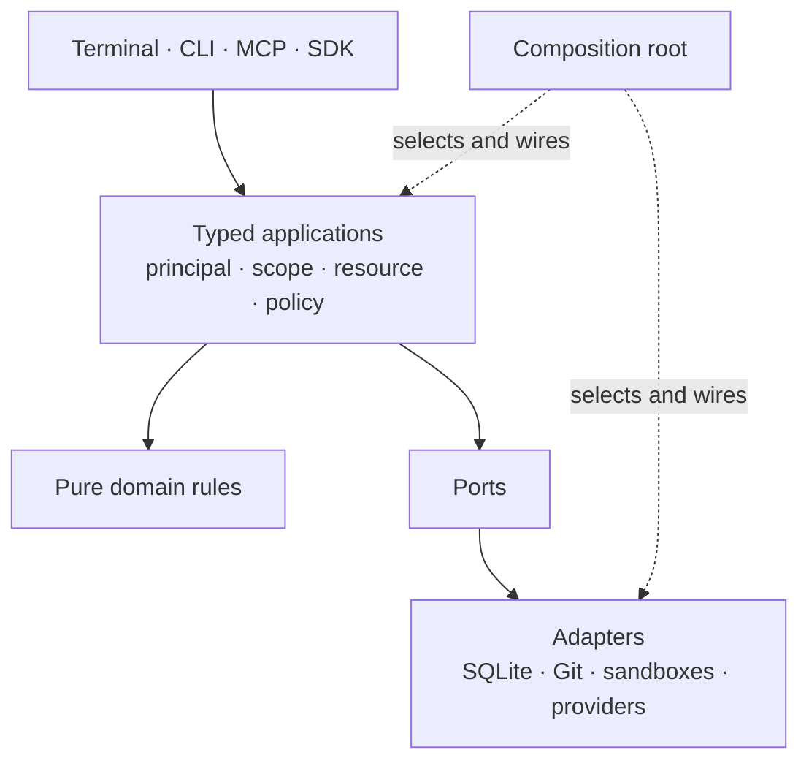

# Architecture overview

[Türkçe](architecture-overview.tr.md) · [Glossary](glossary.md) · [Contributing](../CONTRIBUTING.md)

Deckent is a customer-installed Agent Control & Execution Plane. It combines authorization
and execution: a person, model or tool proposes work; policy determines whether it may run;
a configured execution environment performs it; durable records describe the outcome.
The open Core is Apache-2.0 and can operate independently. Proprietary Enterprise packages
are designed to extend its public contracts and remain separately distributed.

This is a reading guide to the current source architecture, dated 2026-10-09: the released
`1.0.0-alpha.21` plus the `1.0.0-alpha.22` candidate (sandbox hard floors, separate MCP actor). It describes mechanisms and boundaries, not a security certification or
capacity benchmark. [ARCHITECTURE.md](../ARCHITECTURE.md) contains the detailed contracts,
implementation notes and accepted future direction; some of that material is in Turkish.

## Layers and dependency direction

The source tree separates decisions from I/O and presentation. Each unit has a public entry;
callers use that entry rather than another unit's internal files. The composition root is
where implementations are selected and connected.

| Layer | Responsibility | Example |
|---|---|---|
| Platform | Shared infrastructure contracts and utilities | Configuration schemas, layout resolution, clocks and translations |
| Domain | Pure types, validation and state-transition rules | Task states, policy decisions and effect records |
| Capabilities | Reusable capability contracts | Model/provider capability descriptions |
| Engine | Applications that own transitions and declare I/O ports | Admission, scheduling, approval, model calls and delivery |
| Adapters | Implementations of those ports | SQLite storage, Git workspaces, Docker, shell sandboxes and provider transports |
| Surfaces | Human and tool interfaces to applications | CLI, terminal and MCP |
| Composition | Explicit wiring and executable entry points | Core runtime service, CLI and MCP entries |

Domain code does not open files, send requests or select database drivers. Applications own
the sequence and state change; adapters perform the required I/O. Architecture checks enforce
the declared import graph, public unit boundaries and additional dependency constraints.
A surface presents results; it does not introduce an alternative scheduler or policy engine.

This diagram shows responsibilities, rather than granting every layer unrestricted imports.
The exact allowed dependency graph is declared in [arch.json](../arch.json).

## One application contract, several surfaces

The SDK, CLI, terminal and MCP share versioned commands, queries, results and errors. An
operation carries a verified principal, scope and resource; policy is checked at the application
boundary. The runtime service owns operations that need persistent execution and coordination.
Installation, observation and some patch operations compose locally through the same contracts.

Shared semantics do not mean identical authority on every surface. MCP can inspect pending
approvals but has no approval-decision tool. Decisions made through permitted human/SDK paths
still require the applicable identity, policy and live-session checks. A persona, a model's
recommendation or a timeout cannot turn a denied action into an allowed one.

Client/service protocol versions, ledger schema versions and package versions are independent.
Normal operations require compatible clients and services; the limited lifecycle window can
permit inspection or stopping across adjacent versions without permitting normal execution.
Storage upgrades use explicit migrations and backup requirements. A newer executable does not
make an older database or running service automatically compatible.

## Work lifecycle and durable effects

A **Run** admits a graph of **Tasks**. Each **Attempt** records one execution try, including its
worker, workspace and evidence. Applications reserve capacity, respect dependencies and policy,
record execution observations and evaluate outputs. Acceptance, patch integration and delivery
are distinct from process exit. A failed prerequisite can close dependent tasks as skipped;
that is not work that ran successfully.

The transactional SQLite ledger stores work, reservations, approvals, effect records and
receipts. Sealed audit records bind decisions to their context. Resource limits, cancellation,
expiry and crash recovery preserve evidence instead of silently discarding uncertain work.
A Run can park for a decision or missing evidence. A missing worker result is not success.
The current lost-worker closure path still has limitations: a granted attempt can remain active
and retain its slot until custody is resolved.

For external effects, the generic operation contract records intent before sending, carries an
idempotency key and checks the observed target precondition. Where a target can prove settlement,
the receipt records that evidence; otherwise the result remains unknown for reconciliation.
Compensation is a new authorized operation, not an invisible undo. Git patch workflows retain
outputs, test integration against a pinned base and protect delivery from changed targets.
Some older execution/delivery paths still have their own settlement mechanisms; migration to
the generic effect port is incomplete. An extension should reuse the generic contract.

Paid model calls reserve against the scope's shared USD budget. Final usage and a pinned tariff
produce the measured charge using exact arithmetic. This is Deckent's calculation, not the
provider's invoice. Missing final usage keeps funds held; reconciliation records an explicit
settle, release or write-off. Per-provider budgets are still planned.

## Security and isolation

Installation is the hosting/trust boundary. Company is a scoped data boundary, not a directory
sandbox. The intended scope hierarchy is installation → company → optional site/unit → project
→ session; not every organizational administration surface is implemented. Scope membership
and permission to act are checked separately. Policy may allow, deny or require approval;
mandatory restrictions cannot be relaxed by a user setting.

Approval requests bind the action and context, expiry and authorized decision. Permission
modes automate only eligible actions. **Full access** needs a company grant and lasts for the
session; it deliberately broadens host filesystem, home, network and Git access. Denies and
the hard floor remain effective, with effect calls audited. Full access should be understood
as a different exposure level from closed sandbox execution.

Shell execution uses registered backends such as bubblewrap and Landlock; coding workers use
Docker. Git worktrees separate outputs but do not isolate processes, networks or secrets.
Docker shares the host kernel. A `require-sandbox` shell posture refuses unavailable confinement;
`prefer-sandbox` can fall back to the host and reports that posture. Inspect `deckent doctor`
on the actual machine before relying on a sandbox.

Provider API keys are resolved through the configured secret-store port and are masked from
agent-facing content. Native subscription workers can receive bounded credential projections;
that path is distinct from a provider API key. File and encrypted-file stores do not protect
against every program running as the same OS user; the encrypted store's unlock key is local.
A compromised host, broad container mounts or incorrectly granted full access remain meaningful
risks. Check filesystem, process, network and secret boundaries together.

## Extension points and current limits

Public SDK exports are explicit. `deckent/extensions` currently exposes operation-adapter and
secret-store registration plus a CLI entry for a distribution that adds those registrations.
Registration must happen before composition seals the registries; late registration is refused.
Configuration selects registered implementations and policy authorizes their use. Registering
an adapter gives it no execution grant.

The extension model lets a separate package supply a target adapter through the existing effect
contract, or a secret store through its port, without editing Core. It does not promise that
every internal registry is public. Service and MCP extension startup wiring is not yet proven
end to end. ERP integrations and customer identity/SIEM adapters are architectural extension
boundaries, not verified available connectors.

The supported execution path today is Linux and Windows WSL2. macOS and native Windows have
separate platform verification and incomplete execution/security support. The locked bubblewrap
bundle currently ships x86_64; an arm64 build check alone is not arm64 runtime proof. Source
builds require explicit bubblewrap preparation; they can otherwise finish with `bubblewrap=ABSENT`.
See the [contributor quickstart](../CONTRIBUTING.md#a-30-minute-quickstart).

Mission/business-process coordination, natural-language `do` admission, a remote HTTP API,
Desktop, Dashboard, Enterprise SSO/fleet management and microVM isolation remain future work.
Local checks do not establish fleet-scale performance or a supported production deployment on
an untested platform. Evaluate a selected provider, operation and isolation configuration with
its actual success, refusal, cancellation and recovery paths before adopting it.
