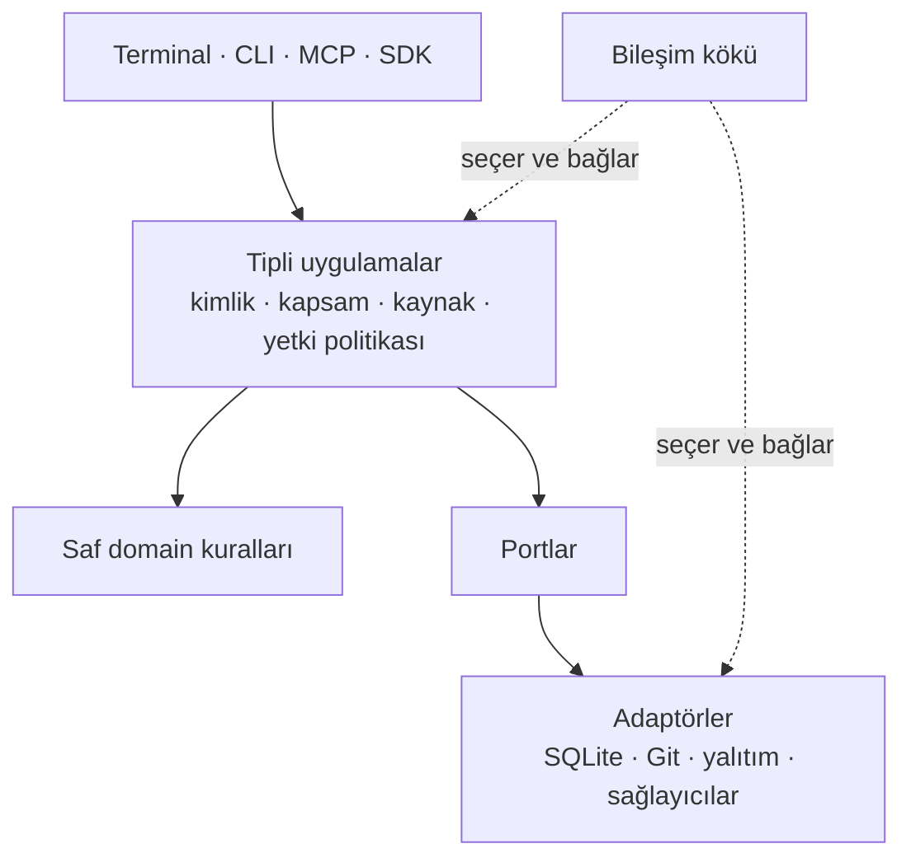

# Mimariye genel bakış

[English](architecture-overview.md) · [Sözlük](glossary.tr.md) · [Katkı rehberi (EN)](../CONTRIBUTING.md)

Deckent, müşterinin kendi altyapısına kurduğu Agent Control & Execution Plane'dir. Yetkilendirme
ile yürütmeyi birleştirir: kişi, model veya araç iş önerir; yetki politikası çalışıp
çalışamayacağını belirler; seçilen ortam işi yürütür; kalıcı kayıtlar sonucu gösterir.
Açık Core Apache-2.0 lisanslıdır ve tek başına çalışabilir. Tescilli Enterprise paketleri,
Core'un herkese açık sözleşmelerini genişletecek biçimde tasarlanır ve ayrı dağıtılır.

Bu rehber, 2026-10-09 tarihindeki kaynak mimarisini açıklar: yayımlanmış `1.0.0-alpha.21` ve
`1.0.0-alpha.22` adayı (sandbox hard floor'ları, ayrı MCP aktörü). Mekanizmaları ve
sınırları anlatır; güvenlik sertifikası veya kapasite ölçümü değildir. [ARCHITECTURE.md](../ARCHITECTURE.md)
ayrıntılı sözleşmeleri, uygulama notlarını ve kabul edilmiş gelecek yönünü içerir;
bu malzemenin bir bölümü Türkçedir.

## Katmanlar ve bağımlılık yönü

Kaynak ağacı kararları, dış dünya ile iletişimi ve sunumu ayırır. Her birimin herkese açık
bir girişi vardır; çağıranlar başka birimin iç dosyalarını kullanmaz. Uygulamalar bileşim
kökünde seçilir ve birbirine bağlanır.

| Katman | Sorumluluk | Örnek |
|---|---|---|
| Platform | Ortak altyapı sözleşmeleri ve yardımcılar | Ayar şemaları, veri yerleşimi, saatler ve çeviriler |
| Domain | Saf tipler, doğrulama ve durum geçişi kuralları | Görev durumları, yetki kararları ve etki kayıtları |
| Capabilities | Yeniden kullanılabilen yetenek sözleşmeleri | Model/sağlayıcı yetenek tanımları |
| Engine | Geçişleri yöneten ve I/O portlarını tanımlayan uygulamalar | İş kabulü, zamanlama, onay, model çağrısı ve teslim |
| Adapters | Bu portların uygulamaları | SQLite, Git çalışma alanları, Docker, kabuk yalıtımı ve sağlayıcı iletişimi |
| Surfaces | İnsan ve araç arayüzleri | CLI, terminal ve MCP |
| Composition | Açık bağlantılar ve çalıştırılabilir girişler | Core yürütme servisi, CLI ve MCP girişleri |

Domain dosya açmaz, istek göndermez ve veritabanı sürücüsü seçmez. İşlemin sırasını ve durum
değişikliğini uygulama yönetir; gerekli I/O'yu adaptör yapar. Mimari kontroller tanımlı
import grafiğini, birimlerin herkese açık sınırlarını ve ek bağımlılık kısıtlarını uygular.
Bir yüzey sonucu sunar; ikinci bir zamanlayıcı ya da yetki motoru oluşturmaz.

Şema sorumlulukları gösterir; tüm katmanlara sınırsız import izni vermez. Kesin bağımlılık
grafiği [arch.json](../arch.json) içinde tanımlıdır.

## Bir uygulama sözleşmesi, birden çok yüzey

SDK, CLI, terminal ve MCP sürümlü komut, sorgu, sonuç ve hataları paylaşır. İşlem doğrulanmış
kimliği, kapsamı ve kaynağı taşır; yetki politikası uygulama sınırında denetlenir. Kalıcı
çalıştırma ve koordinasyon gereken işlemleri yürütme servisi yönetir. Kurulum, gözlem ve
bazı yama işlemleri aynı sözleşmelerle yerel olarak bileştirilir.

Ortak anlam, her yüzeyin aynı yetkiye sahip olduğu anlamına gelmez. MCP bekleyen onayları
inceleyebilir; onay kararı veren aracı yoktur. İzin verilen insan/SDK yollarındaki kararlar
yine kimlik, politika ve canlı oturum denetimlerine tabidir. Persona, model önerisi veya
zaman aşımı reddedilmiş bir işlemi izin verilmiş hale getirmez.

İstemci/servis protokolü, ledger şeması ve paket sürümü birbirinden bağımsızdır. Normal
işlemler uyumlu istemci ve servis gerektirir. Sınırlı yaşam döngüsü uyumluluğu komşu sürümler
arasında inceleme veya durdurmaya izin verebilir; normal yürütmeye izin vermez. Veri
geçişleri açık göç ve yedek gereksinimleriyle yapılır. Yeni çalıştırılabilir dosya eski
veritabanını veya çalışan servisi kendiliğinden uyumlu yapmaz.

## İşin yaşam döngüsü ve kalıcı etkiler

Bir **yürütme (Run)**, **görev (Task)** grafiğini kabul eder. Her **deneme (Attempt)** tek
çalıştırma denemesini, işçiyi, çalışma alanını ve kanıtı kaydeder. Uygulamalar kapasite
ayırır, bağımlılıklara ve politikaya uyar, çalıştırma gözlemlerini kaydeder ve çıktıyı
değerlendirir. İşin kabulü, yama entegrasyonu ve teslim süreç sonlanmasından ayrıdır.
Başarısız ön koşul, bağımlı görevleri atlanmış olarak kapatabilir; bu görevler başarıyla
çalışmış sayılmaz.

İşlemsel SQLite kaydı işleri, ayrılan kaynakları, onayları, etkileri ve makbuzları saklar.
Mühürlü denetim kayıtları kararları bağlamına bağlar. Kaynak sınırları, iptal, süre sonu ve
çökme sonrası kurtarma belirsiz işi sessizce silmek yerine kanıtı korur. Yürütme karar veya
kanıt beklerken duraklatılabilir. Eksik işçi sonucu başarı değildir. Kaybolan işçinin
kapanışında halen sınırlar vardır: başlatılmış deneme, sorumluluğu çözümlenene kadar aktif
kalıp kapasite yerini tutabilir.

Dış etkilerde genel işlem sözleşmesi göndermeden önce niyeti kaydeder, tekrar güvenliği
anahtarı taşır ve hedefte gözlenen ön koşulu denetler. Hedef etkinin kesinleştiğini
kanıtlayabiliyorsa makbuz bu kanıtı kaydeder; aksi halde sonuç uzlaştırma için bilinmeyen
kalır. Telafi, görünmez geri alma değil, yeni yetkili işlemdir. Git yama akışları çıktıyı
saklar, sabitlenmiş temel sürümde entegrasyonu test eder ve teslimi hedef değişikliklerinden
korur. Bazı eski yürütme/teslim yolları kendi etki kesinleştirme mekanizmalarını kullanır;
genel etki portuna geçiş tamamlanmamıştır. Eklentiler genel sözleşmeyi yeniden kullanmalıdır.

Ücretli model çağrıları kapsamın ortak USD bütçesinden pay ayırır. Nihai kullanım ve
sabitlenmiş tarife, kesin aritmetikle ücreti oluşturur. Bu Deckent'in hesabıdır; sağlayıcı
faturası değildir. Nihai kullanım yoksa ayrılan tutar tutulur; uzlaştırma açık bir
kesinleştirme, serbest bırakma veya kayıttan düşme kararı kaydeder. Sağlayıcı başına
bütçeler halen planlanmaktadır.

## Güvenlik ve yalıtım

Kurulum barındırma ve güven sınırıdır. Şirket veri kapsamıdır; dizin yalıtımı değildir.
Hedef hiyerarşi kurulum → şirket → isteğe bağlı tesis/birim → proje → oturumdur; tüm
kuruluş yönetimi yüzeyleri uygulanmış değildir. Kapsam üyeliği ile işlem yetkisi ayrı
kontrol edilir. Politika izin verir, reddeder veya onay gerektirir; zorunlu kısıtlar
kullanıcı ayarıyla gevşetilemez.

Onay istekleri eylemi, bağlamı, süre sonunu ve yetkili kararı bağlar. İzin modları yalnız
uygun işlemleri otomatikleştirir. **Tam erişim** şirket izni gerektirir ve oturumla sınırlıdır;
ana makine dosya sistemi, ev dizini, ağ ve Git erişimini bilerek genişletir. Retler ve
değişmez koruma sınırı geçerlidir; etki çağrıları denetim kaydına girer. Tam erişimin
maruziyeti, kapalı yalıtım görünümünden farklıdır.

Kabuk yürütmesi bubblewrap ve Landlock gibi kayıtlı uygulamaları; kodlama işçileri Docker'ı
kullanır. Git çalışma ağaçları çıktıları ayırır, süreçleri, ağı veya sırları yalıtmaz.
Docker ana makine çekirdeğini paylaşır. `require-sandbox`, yalıtım yoksa reddeder;
`prefer-sandbox` ana makineye düşebilir ve bunu bildirir. Yalıtıma güvenmeden önce gerçek
makinede `deckent doctor` çıktısını inceleyin.

Sağlayıcı API anahtarları seçili sır deposu portuyla çözülür ve ajana sunulan içerikten
maskelenir. Native abonelik işçileri sınırlandırılmış kimlik bilgisi kopyalarını alabilir;
bu yol sağlayıcı API anahtarından ayrıdır. Dosya ve şifreli dosya depoları aynı işletim
sistemi kullanıcısıyla çalışan her programa karşı koruma sağlamaz; şifreli deponun açma
anahtarı yereldir. Ele geçirilmiş ana makine, geniş konteyner bağlamaları veya yanlış
verilmiş tam erişim anlamlı risklerdir. Dosya sistemi, süreç, ağ ve sır sınırlarını birlikte
kontrol edin.

## Eklenti noktaları ve bugünkü sınırlar

Herkese açık SDK dışa aktarımları açıkça listelenir. `deckent/extensions` bugün işlem
adaptörü ve sır deposu kaydı ile bu kayıtları ekleyen dağıtım için CLI girişini sunar.
Kayıt, bileşim kökü kayıt dizinlerini mühürlemeden önce yapılmalıdır; geç kayıt reddedilir.
Ayarlar kayıtlı uygulamayı seçer, politika kullanımı yetkilendirir. Adaptör kaydı yürütme
izni vermez.

Ayrı paket, Core'u değiştirmeden mevcut etki sözleşmesiyle hedef adaptörü veya portuyla
sır deposu sağlayabilir. Bu, her iç kayıt dizininin dışa açıldığı anlamına gelmez. Servis
ve MCP eklenti başlangıç bağlantıları uçtan uca kanıtlanmış değildir. ERP entegrasyonları
ve müşteri kimlik/SIEM adaptörleri mimari eklenti sınırlarıdır; doğrulanmış hazır
bağlayıcılar değildir.

Bugünkü desteklenen yürütme yolu Linux ve Windows WSL2'dir. macOS ve native Windows ayrı
platform doğrulamasına sahiptir; yürütme/güvenlik desteği tamamlanmamıştır. Kilitli bubblewrap
paketi bugün x86_64 sunar; arm64 derleme kontrolü arm64 yürütme kanıtı değildir. Kaynaktan
build açık bubblewrap hazırlığı ister; hazırlık olmadan `bubblewrap=ABSENT` ile tamamlanabilir.
[Katkıcı hızlı başlangıcına (EN)](../CONTRIBUTING.md#a-30-minute-quickstart) bakın.

Mission/iş süreci koordinasyonu, doğal dilden `do` kabulü, uzak HTTP API, Desktop, Dashboard,
Enterprise SSO/toplu kurulum yönetimi ve microVM yalıtımı gelecek işlerdir. Yerel kontroller
filo ölçeğinde performansı veya denenmemiş platformdaki üretim desteğini kanıtlamaz.
Benimsemeden önce seçili sağlayıcı, işlem ve yalıtım ayarlarının gerçek başarı, ret,
iptal ve kurtarma yollarını değerlendirin.
